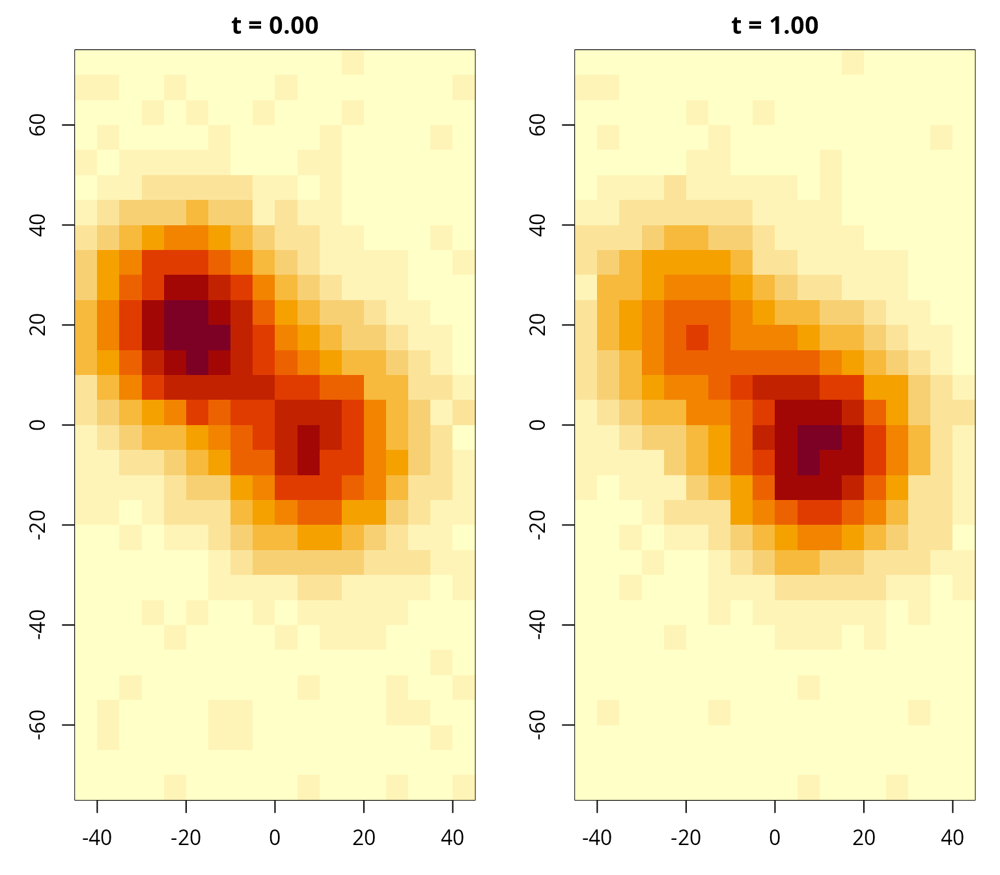
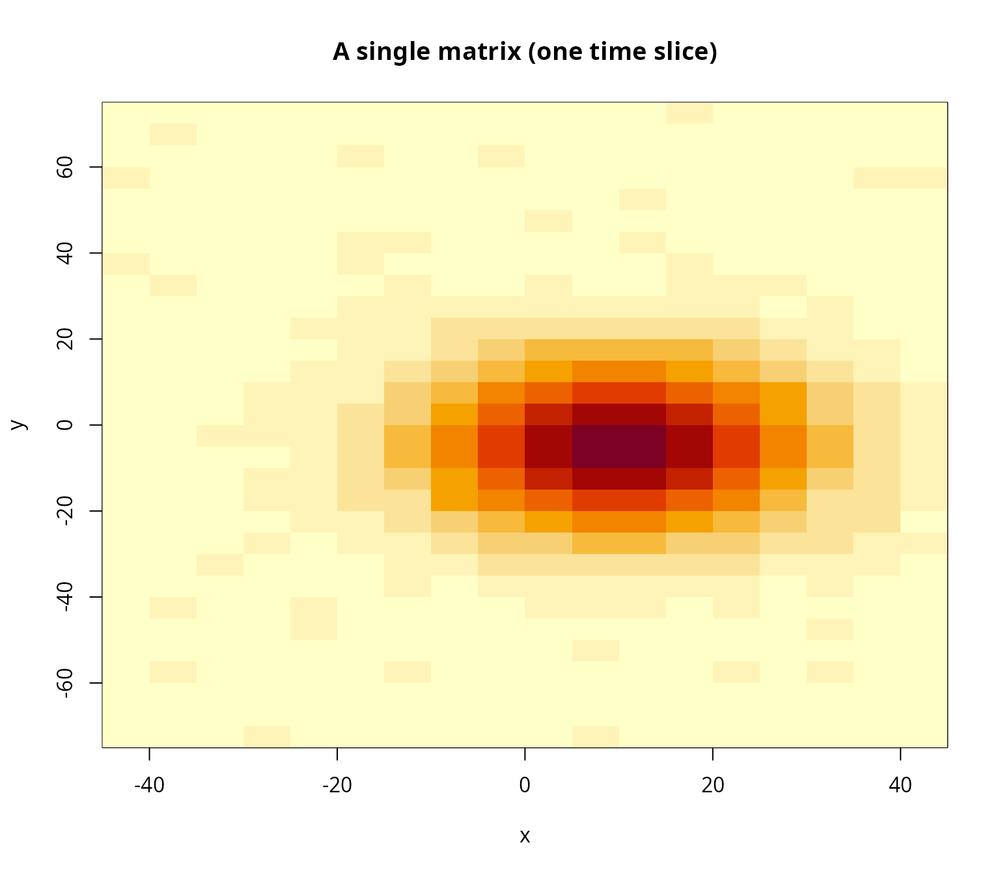
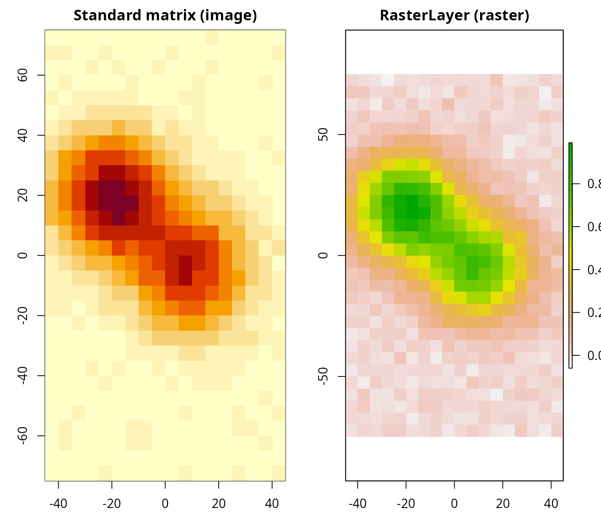
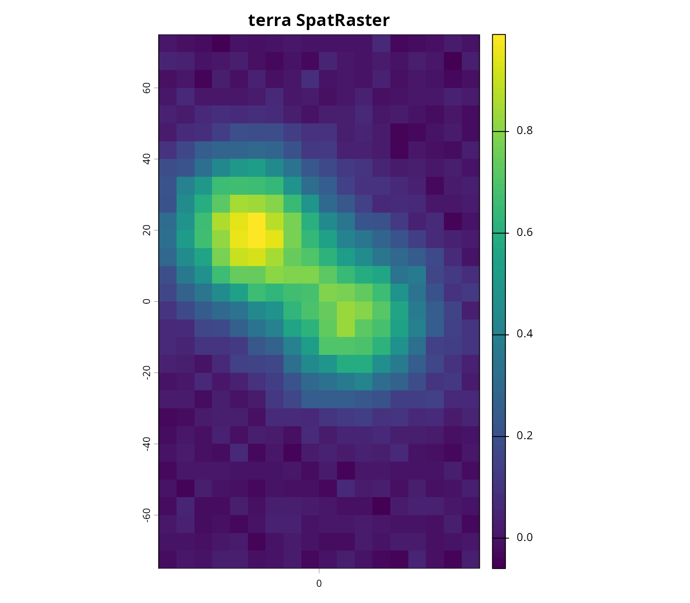

# Preparing covariates for admove

This vignette shows how to prepare **gridded covariates** for use with
**admove**. In particular, it demonstrates how common data structures
(matrices, arrays, lists, and raster objects) can be converted into the
standard format expected by
[`prep_cov()`](https://tokami.github.io/admove/reference/prep_cov.md).

In *admove*, covariates (e.g., habitat suitability, temperature,
chlorophyll, depth) are represented as **fields on a regular spatial
grid**, optionally varying over time. The helper
[`prep_cov()`](https://tokami.github.io/admove/reference/prep_cov.md)
standardises different input formats into a single representation used
internally by the package.

[`prep_cov()`](https://tokami.github.io/admove/reference/prep_cov.md) is
designed to accept:

- a numeric **matrix** (one spatial field, single time slice),
- a numeric **array** (multiple time slices),
- a **list** of matrices/arrays (one element per time slice),
- a `RasterLayer` / `RasterBrick` / `RasterStack` (from **raster**, if
  available),
- a `SpatRaster` (from **terra**, if available).

The output is an object of class `admove_cov` (internally a numeric
array) with dimensions corresponding to space and time.

``` r
library(admove)
```

## Target data format for all covariates

The standard representation used by *admove* is a 3D array

- `cov[x, y, t]`

where

- the first dimension indexes **x** (east–west),
- the second dimension indexes **y** (north–south),
- the third dimension indexes **time**.

To support plotting and model setup, it is strongly recommended to
provide **dimnames** for the first two dimensions (and ideally also for
time):

- `dimnames(cov)[[1]]`: x-coordinates (cell midpoints),
- `dimnames(cov)[[2]]`: y-coordinates (cell midpoints),
- `dimnames(cov)[[3]]`: time labels (preferably numeric times or date
  strings).

### How time slices are interpreted

The time vector describes **the start of the interval** over which each
time slice should be used and corresponds in *admove* convention to the
time since a origin specified in the time reference information
(`admove_tref`). For example, if the time labels are `0` and `1`, the
slices are valid for the first and second time steps. To which date `0`
corresponds to is specified in `tref()$origin` and the time step between
`0` and `1` is specified in `tref()$units`.

More on that below, for now, we can work with dates, e.g. `2025-01-01`
and `2025-04-01`, or decimal years, e.g. `2025.00` and `2025.25`. In
this case, *admove* uses the first covariate field up to (but not
including) `2025.25`, and the second field from `2025.25` onward. More
generally: each slice is assumed valid from its start time until the
start time of the next slice.

## A minimal example in target format

Below we simulate an array of four covariate fields in the target
format.

``` r
## Set seed for reproducibility
set.seed(1)

## Define grid midpoints
x <- seq(-42.5, 42.5, by = 5)
y <- seq(-72.5, 72.5, by = 5)

## Define start times of time intervals
tvals <- c(0, 1, 2, 3)

## Simulate two smooth "basis" fields
mat1 <- outer(x, y, function(xx, yy) {
  exp(-((xx - 10)^2 + (yy + 5)^2) / (2 * 15^2))
}) + matrix(rnorm(length(x) * length(y), 0, 0.02),
            nrow = length(x), ncol = length(y))

mat2 <- outer(x, y, function(xx, yy) {
  exp(-((xx + 20)^2 + (yy - 20)^2) / (2 * 15^2))
}) + matrix(rnorm(length(x) * length(y), 0, 0.02),
            nrow = length(x), ncol = length(y))

## Build a time-varying covariate array as mixtures of mat1/mat2
arr <- array(NA_real_, dim = c(length(x), length(y), length(tvals)))
for (k in seq_along(tvals)) {
  p <- runif(2)
  arr[, , k] <- p[1] * mat1 + p[2] * mat2 + 0.2 * sin(2 * pi * (k - 1) / length(tvals))
}

## Attach dimnames (note: dimnames are character vectors by definition)
dimnames(arr) <- list(
  x = sprintf("%.2f", x),
  y = sprintf("%.2f", y),
  t = sprintf("%.2f", tvals)
)

## Plot two time slices
par(mfrow = c(1, 2), mar = c(3, 3, 2, 1))
image(x, y, arr[, , 1], main = paste("t =", dimnames(arr)[[3]][1]), xlab = "x", ylab = "y")
image(x, y, arr[, , 2], main = paste("t =", dimnames(arr)[[3]][2]), xlab = "x", ylab = "y")
par(mfrow = c(1, 1))
```



The array format above is the *target*. In practice, however, covariate
data often arrive in other layouts. The sections below show how to use
[`prep_cov()`](https://tokami.github.io/admove/reference/prep_cov.md) to
standardise common input formats.

## Common format A: a single field as a matrix

Some covariates come as a single field that is effectively constant over
time, such as bathymetry or (static) habitat classifications. We use
`mat1` as an example:

``` r
image(x, y, mat1, main = "A single matrix (one time slice)", xlab = "x", ylab = "y")
```



You can convert a single matrix using
[`prep_cov()`](https://tokami.github.io/admove/reference/prep_cov.md):

``` r
cov1 <- prep_cov(mat1)
```

As the messages indicate, if `mat1` has no row/column names,
[`prep_cov()`](https://tokami.github.io/admove/reference/prep_cov.md)
must fall back to row/column indices, which is rarely what you want. In
almost all real workflows you should use the `x_centers` and `y_centers`
arguments of the function:

``` r
cov1 <- prep_cov(mat1, x_centers = x, y_centers = y)
```

or attach the grid coordinates via
[`rownames()`](https://rdrr.io/r/base/colnames.html) and
[`colnames()`](https://rdrr.io/r/base/colnames.html):

``` r
rownames(mat1) <- x
colnames(mat1) <- y

cov1 <- prep_cov(mat1)
```

A 2D matrix is automatically promoted to a 3D array with a singleton
time dimension (i.e., `t = 0`):

``` r
dimnames(cov1)[[3]]
#> [1] "0"
```

## Common format B: multiple time slices as a 3D array

Time-varying covariates (e.g., temperature) are often provided as a 3D
array whose third dimension is time. This already matches the target
representation, so conversion is straightforward:

``` r
cov2 <- prep_cov(arr)
summary(cov2)
#> <admove_cov>
#>   cells:     540
#>   dims:      18 x 30 x 4
#>   cellsize:  5 x 5
#>   xrange:    [-45.00, 45.00]
#>   yrange:    [-75.00, 75.00]
#>   trange:    [0.00, 3.00]
#>   cov range: [-0.23, 0.99]
#>   NAs:       0
#>   units:     not specified x not specified
```

The third-dimension labels should describe the start time of each
interval (e.g., decimal years or date strings). See the section
*Converting dates to decimal dates* below for convenient date parsing.

``` r
dimnames(cov2)[[3]]
#> [1] "0.00" "1.00" "2.00" "3.00"
```

### Common format C: multiple time slices as a list of matrices

Another common representation is a list where each element corresponds
to one time slice. Here we create such a list from the array above:

``` r
lst <- lapply(seq_len(dim(arr)[3]), function(k) arr[, , k, drop = FALSE])
cov3 <- prep_cov(lst)
summary(cov3)
#> <admove_cov>
#>   cells:     540
#>   dims:      18 x 30 x 4
#>   cellsize:  5 x 5
#>   xrange:    [-45.00, 45.00]
#>   yrange:    [-75.00, 75.00]
#>   trange:    [0.00, 3.00]
#>   cov range: [-0.23, 0.99]
#>   NAs:       0
#>   units:     not specified x not specified
```

Internally, the list is converted to a 3D array. If list elements do not
have dimnames, add them before conversion so that coordinates and time
metadata are carried through correctly.

## Common format D: Raster\* objects (raster)

Many covariate products are distributed as rasters. If the **raster**
package is available,
[`prep_cov()`](https://tokami.github.io/admove/reference/prep_cov.md)
supports `RasterLayer` objects directly (Hijmans 2025). This section
shows a small example using the simulated data above.

``` r
install.packages("raster")
```

``` r
library(raster)

dx <- diff(x)[1]
dy <- diff(y)[1]

## Define raster extent using cell edges (centers +/- half a cell)
r <- raster::raster(
  xmn = min(x) - dx/2, xmx = max(x) + dx/2,
  ymn = min(y) - dy/2, ymx = max(y) + dy/2,
  res = c(dx, dy),
  crs = NA
)

stopifnot(ncol(r) == length(x), nrow(r) == length(y))
```

### Orientation note (matrix vs raster)

A frequent source of mistakes is that **raster objects and R matrices
use different conventions** for how the y-axis is oriented when values
are stored as a vector. To ensure the raster matches the matrix plot you
see with
[`image()`](https://rspatial.github.io/terra/reference/image.html), we
flip the matrix in the y-direction before assigning values:

``` r
mat_topdown <- arr[, , 1][, ncol(arr[, , 1]):1, drop = FALSE]
raster::values(r) <- as.vector(mat_topdown)

par(mfrow = c(1, 2), mar = c(3, 3, 2, 1))
image(x, y, arr[, , 1], main = "Standard matrix (image)", xlab = "x", ylab = "y")
plot(r, main = "RasterLayer (raster)")
par(mfrow = c(1, 1))
```



Now the raster can be converted directly:

``` r
cov_r <- prep_cov(r)
summary(cov_r)
#> <admove_cov>
#>   cells:     540
#>   dims:      18 x 30 x 1
#>   cellsize:  5 x 5
#>   xrange:    [-45.00, 45.00]
#>   yrange:    [-75.00, 75.00]
#>   trange:    [0.00, 0.00]
#>   cov range: [-0.06, 0.99]
#>   NAs:       0
#>   units:     not specified x not specified
```

If you prefer not to depend on **raster** inside your workflow, you can
always convert raster-like objects outside *admove* and pass a
matrix/array to
[`prep_cov()`](https://tokami.github.io/admove/reference/prep_cov.md).

## Common format E: terra data (SpatRaster)

The **terra** package is increasingly common for raster data (GeoTIFF,
NetCDF, etc.) (Hijmans 2026). If **terra** is available, *admove* can
convert `SpatRaster` objects directly.

``` r
install.packages("terra")
```

``` r
library(terra)

dx <- diff(x)[1]
dy <- diff(y)[1]

t <- terra::rast(
  ncols = length(x),
  nrows = length(y),
  xmin  = min(x) - dx/2, xmax = max(x) + dx/2,
  ymin  = min(y) - dy/2, ymax = max(y) + dy/2,
  crs   = ""
)

## Use the same orientation adjustment as in the raster example
mat_topdown <- arr[, , 1][, ncol(arr[, , 1]):1, drop = FALSE]
terra::values(t) <- as.vector(mat_topdown)

plot(t, main = "terra SpatRaster")
```



``` r
cov_t <- prep_cov(t)
summary(cov_t)
#> <admove_cov>
#>   cells:     540
#>   dims:      18 x 30 x 1
#>   cellsize:  5 x 5
#>   xrange:    [-45.00, 45.00]
#>   yrange:    [-75.00, 75.00]
#>   trange:    [0.00, 0.00]
#>   cov range: [-0.06, 0.99]
#>   NAs:       0
#>   units:     not specified x not specified
```

### terra time stacks (multi-layer SpatRaster)

Time-varying fields can be represented as multi-layer `SpatRaster`
objects (one layer per time slice). These can also be converted by
[`prep_cov()`](https://tokami.github.io/admove/reference/prep_cov.md).

``` r
t_stack <- c(t, t)

## Layer names should ideally encode time information
names(t_stack) <- c("2025.00", "2025.50")

cov_t_stack <- prep_cov(t_stack, date_decimal = TRUE)
summary(cov_t_stack)
#>         Length Class      Mode   
#> 2025.00 540    admove_cov numeric
#> 2025.50 540    admove_cov numeric
```

## Common format F: NetCDF data (ncdf4)

Many oceanographic and atmospheric products are distributed as NetCDF
files. These often store variables as arrays with dimensions such as
`lon × lat × time` (or `x × y × time`).
[`prep_cov()`](https://tokami.github.io/admove/reference/prep_cov.md)
does not read NetCDF files directly, but you can read a variable with
**ncdf4** and then pass a matrix/array to
[`prep_cov()`](https://tokami.github.io/admove/reference/prep_cov.md)
(Pierce 2025).

Below we create a small dummy NetCDF file to demonstrate the workflow.

``` r
install.packages("ncdf4")
```

``` r
library(ncdf4)

tmpfile <- tempfile(fileext = ".nc")

## Define time stamps as Dates (start of each interval)
t_dates <- as.Date(c("2025-01-01", "2025-04-01", "2025-07-01", "2025-10-01"))

## NetCDF dimensions
dim_x <- ncdim_def("x", "km", vals = x)
dim_y <- ncdim_def("y", "km", vals = y)

## NetCDF time is usually numeric with a units string
time_units <- "days since 1970-01-01"
time_vals  <- as.numeric(t_dates - as.Date("1970-01-01"))
dim_t <- ncdim_def("time", time_units, vals = time_vals)

var_cov <- ncvar_def(
  name = "cov",
  units = "1",
  dim = list(dim_x, dim_y, dim_t),
  missval = NA_real_,
  longname = "dummy covariate"
)

nc <- nc_create(tmpfile, vars = list(var_cov))
ncvar_put(nc, var_cov, arr)
nc_close(nc)
```

Now we read the file, extract coordinates and time metadata, and attach
dimnames in the *admove* convention `[x, y, t]`:

``` r
nc <- nc_open(tmpfile)

x_read    <- ncvar_get(nc, "x")
y_read    <- ncvar_get(nc, "y")
time_read <- ncvar_get(nc, "time")  ## numeric days since 1970-01-01
cov_read  <- ncvar_get(nc, "cov")

nc_close(nc)

t_read <- as.Date(time_read, origin = "1970-01-01")

dimnames(cov_read) <- list(
  x = sprintf("%.2f", x_read),
  y = sprintf("%.2f", y_read),
  t = format(t_read)
)

cov_nc <- prep_cov(cov_read, date_format = "%Y-%m-%d")
summary(cov_nc)
#> <admove_cov>
#>   cells:     540
#>   dims:      18 x 30 x 4
#>   cellsize:  5 x 5
#>   xrange:    [-45.00, 45.00]
#>   yrange:    [-75.00, 75.00]
#>   trange:    [0.43, 39.43]
#>              [2025-01-01 00:11:52
#>                  2025-10-01 18:11:52]
#>   cov range: [-0.23, 0.99]
#>   NAs:       0
#>   units:     not specified x week
```

### Notes on real NetCDF files

Real products often use different dimension names and orders, e.g.
`lon × lat × time`, `time × lat × lon`, or include additional dimensions
such as depth. In those cases you typically need to:

- identify which dimensions correspond to x/lon and y/lat,
- select/aggregate over depth (if present),
- **permute** the array into `[x, y, t]` using
  [`aperm()`](https://rdrr.io/r/base/aperm.html).

For example, if the array were `[time, y, x]`, you would do:

``` r
cov_xy_t <- aperm(cov_read, c(3, 2, 1))  ## (time, y, x) -> (x, y, time)
```

and then attach `dimnames(cov_xy_t) <- list(x=..., y=..., t=...)` before
calling
[`prep_cov()`](https://tokami.github.io/admove/reference/prep_cov.md) or
use the arguments `x_centers`, `y_centers` and `times`.

## Other functionality of `prep_cov()`

### Converting date strings and decimal years to numeric time

If the third dimension uses date strings,
[`prep_cov()`](https://tokami.github.io/admove/reference/prep_cov.md)
can parse them via `date_format` and `date_origin` and convert them to a
numeric time scale (e.g., weeks since origin) used internally.

For example, monthly fields labelled as `"YYYY-MM-DD"`:

``` r
months <- c("2020-01-01", "2020-04-01", "2020-07-01", "2020-10-01")

arr_month <- array(NA_real_, dim = c(length(x), length(y), length(months)))
for (k in seq_along(months)) {
  arr_month[, , k] <- mat1 + 0.1 * k
}

dimnames(arr_month) <- list(
  x = sprintf("%.2f", x),
  y = sprintf("%.2f", y),
  t = months
)

cov_month <- prep_cov(arr_month, date_format = "%Y-%m-%d")
dimnames(cov_month)[[3]]
#> [1] "0.428571428571429" "13.4285714285714"  "26.4285714285714" 
#> [4] "39.5714285714286"
```

### Specifying time reference information

The time reference information is important as it stores the origin to
which time `0` corresponds to and the units that defines if `1`
corresponds to one day, week, month, year, etc.

For that reason,
[`prep_cov()`](https://tokami.github.io/admove/reference/prep_cov.md)
includes the `tref` argument that allows specifying these important
variables. For example, we can prepare the covariate fields from above
with the corresponding `tref` information by

``` r
cov2 <- prep_cov(arr,
                 tref = list(origin = "2020-01-01",
                            units = "quarter"))
```

Now, the numeric values in `dimnames(cov2)[[3]]` cannot be
misinterpreted any longer as the time reference information is clear:

``` r
tref(cov2)
#> $origin
#> [1] "2020-01-01 CET"
#> 
#> $units
#> [1] "quarter"
#> 
#> $period
#> [1] 4
#> 
#> attr(,"class")
#> [1] "admove_tref"
```

This information is also provided in the summary:

``` r
summary(cov2)
#> <admove_cov>
#>   cells:     540
#>   dims:      18 x 30 x 4
#>   cellsize:  5 x 5
#>   xrange:    [-45.00, 45.00]
#>   yrange:    [-75.00, 75.00]
#>   trange:    [0.00, 3.00]
#>              [2020-01-01 00:00:00
#>                  2020-09-30 19:00:00]
#>   cov range: [-0.23, 0.99]
#>   NAs:       0
#>   units:     not specified x quarter
```

Of course, the information can also be added after the preparation of
the covariate fields:

``` r
cov2 <- prep_cov(arr)

cov2 <- add_tref(cov2, list(origin = "2020-01-01",
                              units = "quarter"))

tref(cov2)
#> $origin
#> [1] "2020-01-01 CET"
#> 
#> $units
#> [1] "quarter"
#> 
#> $period
#> [1] 4
#> 
#> attr(,"class")
#> [1] "admove_tref"
```

If dates or decimal years are provided rather than a numeric value,
[`prep_cov()`](https://tokami.github.io/admove/reference/prep_cov.md)
will try to infer the time reference information. For example, for the
`cov_nc` and `cov_t_stack` the information was inferred from the data:

``` r
tref(cov_nc)
tref(cov_t_stack)
```

Nevertheless, we recommend to specify `tref` for covariate fields
explicitely.

If the `tref` information was not inferred correctly, the
[`shift_tref()`](https://tokami.github.io/admove/reference/shift_tref.md)
and
[`scale_tref()`](https://tokami.github.io/admove/reference/scale_tref.md)
functions allow to correct the information:

``` r
cov2 <- shift_tref(cov2, origin = "2024-01-01")

cov2 <- scale_tref(cov2, units = "month")
```

Now, the covariate fields corresponds to months starting in January 1st
2024:

``` r
tref(cov2)
#> $origin
#> [1] "2024-01-01"
#> 
#> $units
#> [1] "month"
#> 
#> $period
#> [1] 12
#> 
#> attr(,"class")
#> [1] "admove_tref"
```

### Specifying space reference information

Similar to the time reference information, the spatial information of
the gridded covariate fields also refers to a certain coordinate system
(CRS) and units. Therefore, the covariate fields also contain a `sref`
object. However, in contrast to the time reference information, there is
no way to infer the CRS and unit from the position information alone.
Thus, if not specified (default), the information is just `NA`:

``` r
sref(cov2)
#> $crs
#> [1] NA
#> 
#> $units
#> [1] NA
#> 
#> $crs_scale
#> [1] NA
#> 
#> attr(,"class")
#> [1] "admove_sref"
```

Therefore, it is recommended to specify the spatial reference system by
either using the `sref` argument of
[`prep_cov()`](https://tokami.github.io/admove/reference/prep_cov.md):

``` r
cov2 <- prep_cov(arr,
                 tref = list(origin = "2020-01-01",
                            units = "quarter"),
                 sref = list(crs = 4326))

sref(cov2)
#> $crs
#> [1] "GEOGCRS[\"WGS 84\",\n    ENSEMBLE[\"World Geodetic System 1984 ensemble\",\n        MEMBER[\"World Geodetic System 1984 (Transit)\"],\n        MEMBER[\"World Geodetic System 1984 (G730)\"],\n        MEMBER[\"World Geodetic System 1984 (G873)\"],\n        MEMBER[\"World Geodetic System 1984 (G1150)\"],\n        MEMBER[\"World Geodetic System 1984 (G1674)\"],\n        MEMBER[\"World Geodetic System 1984 (G1762)\"],\n        MEMBER[\"World Geodetic System 1984 (G2139)\"],\n        MEMBER[\"World Geodetic System 1984 (G2296)\"],\n        ELLIPSOID[\"WGS 84\",6378137,298.257223563,\n            LENGTHUNIT[\"metre\",1]],\n        ENSEMBLEACCURACY[2.0]],\n    PRIMEM[\"Greenwich\",0,\n        ANGLEUNIT[\"degree\",0.0174532925199433]],\n    CS[ellipsoidal,2],\n        AXIS[\"geodetic latitude (Lat)\",north,\n            ORDER[1],\n            ANGLEUNIT[\"degree\",0.0174532925199433]],\n        AXIS[\"geodetic longitude (Lon)\",east,\n            ORDER[2],\n            ANGLEUNIT[\"degree\",0.0174532925199433]],\n    USAGE[\n        SCOPE[\"Horizontal component of 3D system.\"],\n        AREA[\"World.\"],\n        BBOX[-90,-180,90,180]],\n    ID[\"EPSG\",4326]]"
#> 
#> $units
#> [1] "degree"
#> 
#> $crs_scale
#> [1] 1
#> 
#> attr(,"class")
#> [1] "admove_sref"
```

or by adding the `sref` afterwards:

``` r
cov2 <- prep_cov(arr,
                 tref = list(origin = "2020-01-01",
                            units = "quarter"))

cov2 <- add_sref(cov2, list(crs = 4326))

sref(cov2)
#> $crs
#> [1] "GEOGCRS[\"WGS 84\",\n    ENSEMBLE[\"World Geodetic System 1984 ensemble\",\n        MEMBER[\"World Geodetic System 1984 (Transit)\"],\n        MEMBER[\"World Geodetic System 1984 (G730)\"],\n        MEMBER[\"World Geodetic System 1984 (G873)\"],\n        MEMBER[\"World Geodetic System 1984 (G1150)\"],\n        MEMBER[\"World Geodetic System 1984 (G1674)\"],\n        MEMBER[\"World Geodetic System 1984 (G1762)\"],\n        MEMBER[\"World Geodetic System 1984 (G2139)\"],\n        MEMBER[\"World Geodetic System 1984 (G2296)\"],\n        ELLIPSOID[\"WGS 84\",6378137,298.257223563,\n            LENGTHUNIT[\"metre\",1]],\n        ENSEMBLEACCURACY[2.0]],\n    PRIMEM[\"Greenwich\",0,\n        ANGLEUNIT[\"degree\",0.0174532925199433]],\n    CS[ellipsoidal,2],\n        AXIS[\"geodetic latitude (Lat)\",north,\n            ORDER[1],\n            ANGLEUNIT[\"degree\",0.0174532925199433]],\n        AXIS[\"geodetic longitude (Lon)\",east,\n            ORDER[2],\n            ANGLEUNIT[\"degree\",0.0174532925199433]],\n    USAGE[\n        SCOPE[\"Horizontal component of 3D system.\"],\n        AREA[\"World.\"],\n        BBOX[-90,-180,90,180]],\n    ID[\"EPSG\",4326]]"
#> 
#> $units
#> [1] "degree"
#> 
#> $crs_scale
#> [1] 1
#> 
#> attr(,"class")
#> [1] "admove_sref"
```

## Sanity checks before modelling

Covariate fields are easy to accidentally transpose or flip. Before
fitting a model, it is useful to verify:

1.  **Dimensions:** do they match your expected grid resolution?
2.  **Coordinates:** are x and y numeric and monotonic?
3.  **Orientation:** does increasing y go “up” in plots, and does the
    covariate appear where you expect it geographically?
4.  **Time alignment:** do covariate time slices cover the time range of
    the tag observations, and are interval start times correct?

A quick practical habit is to plot a known feature (e.g.,
coastline-aligned bathymetry gradients) and confirm it looks correct in
both your original data and the prepared `admove_cov` object.

## Saving prepared data

To ensure reproducibility, save the prepared object to disk with
[`saveRDS()`](https://rspatial.github.io/terra/reference/serialize.html):

``` r
saveRDS(cov2, file = "prepared_cov.rds")
```

## Summary

This vignette described the covariate data structures expected by
*admove* and demonstrated how to convert common input types into the
standard `admove_cov` representation used internally by the package.

In practice, most workflows start from either:

- a raster product (GeoTIFF / NetCDF read into **terra** or **raster**),
  or
- a 3D array already close to `[x, y, time]`.

The key requirements are a regular grid, consistent orientation, and
(ideally) coordinate and time metadata stored as dimnames so covariate
fields can be aligned with tagging observations. Once prepared, standard
methods such as
[`summary()`](https://rspatial.github.io/terra/reference/summary.html)
and [`plot()`](https://rspatial.github.io/terra/reference/plot.html) can
be used for quick inspection (e.g., `summary(cov2)` or `plot(cov_r)`).

## References

Hijmans, Robert J. 2025. *Raster: Geographic Data Analysis and
Modeling*. Manual. <https://doi.org/10.32614/CRAN.package.raster>.

———. 2026. *Terra: Spatial Data Analysis*. Manual.
<https://doi.org/10.32614/CRAN.package.terra>.

Pierce, David. 2025. *Ncdf4: Interface to Unidata netCDF (Version 4 or
Earlier) Format Data Files*. Manual.
<https://doi.org/10.32614/CRAN.package.ncdf4>.
