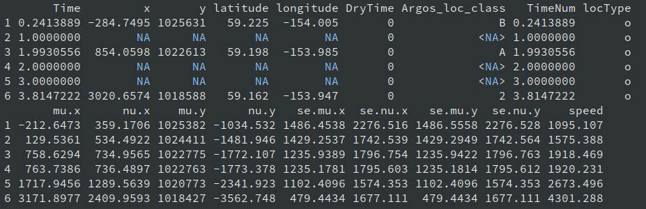

# Preparing tagging data for admove

This vignette shows how to prepare tagging data in the formats expected
by **admove**.

The package currently supports three tag types:

- **Data-storage (archival) tags**
- **Mark-resight tags**
- **Mark-recapture (conventional) tags**

In *admove*, data-storage tags are referred to as `dtags` (tag type
`"d"`), mark-resight tags as `stags` (tag type `"s"`), and
mark-recapture tags as `ctags` (tag type `"c"`).

With minor exceptions (e.g., observation uncertainty), *admove* treats
these tag types as different “views” of the same underlying population
movement process, but with different sampling intensity. Typically:

- `dtags` contain hundreds to thousands of positions at regular and fine
  time steps,
- `stags` contain sparse and irregular observations (from a few to
  hundreds),
- `ctags` contain exactly two positions (release and recapture).

Internally, all tags are stored in a single *long* data frame with one
row per **observation** (a position at a time) and columns for time,
position, tag ID, and tag type.

``` r
library(admove)
library(lubridate)
```

## Target data format for all tag types

The target format for all tag types (`dtags`, `stags`, `ctags`) is a
**long data frame** where each row corresponds to one observation for
one tag.

Required columns:

- `t`: numeric; elapsed time since origin
- `x`: numeric; x-coordinate (longitude in degrees *or* projected
  easting in m/km)
- `y`: numeric; y-coordinate (latitude in degrees *or* projected
  northing in m/km)
- `id`: identifier linking observations belonging to the same tag

### Time (`t`)

*admove* uses numeric time. The
[`prep_tags()`](https://tokami.github.io/admove/reference/prep_tags.md)
function can convert common date formats (e.g. `"2020-04-12"`, `Date`,
days-since-origin) into the required format that is elapsed time since
origin as in *admove* convention, e.g. 3.42 weeks since “2020-01-01”,
where the time units is specified in `tref()$units` and the origin in
`tref()$origin`.

A practical recommendation is to: - keep all timestamps in a consistent
timezone (often `"UTC"`), - avoid duplicated timestamps within a tag
unless you intentionally allow them.

### Position (`x`, `y`)

*admove* expects observed or pre-estimated positions (e.g.,
longitude/latitude or projected coordinates). If your raw data are
environmental measurements (light, depth/pressure, temperature) that
must be converted to locations, do that pre-processing first (e.g., with
geolocation or state-space methods).

You may use geographic coordinates (degrees) or projected coordinates
(m, km), as long as you are consistent across all observations and tags.
For tasks that use distances (e.g., speed filtering), projected
coordinates are usually easier and less error-prone.

### Identifier (`id`)

`id` can be any character string or factor (e.g., `"1"`, `"k40a8"`,
`"tag_001"`). It is only used to group observations by tag.

You do not need to supply a `type` column;
[`prep_tags()`](https://tokami.github.io/admove/reference/prep_tags.md)
adds it automatically. Additional columns are allowed and will be
carried along. However, to avoid duplicate names after standardisation,
any *original* columns named `t`, `x`, or `y` may be dropped/replaced
during preparation.

## A minimal example in target format

Below we simulate two short tracks in the target format.

``` r
## construct dummy track a
track_a <- data.frame(
  t = 0:5,
  x = c(12.0, 12.1, 12.2, 12.2, 12.3, 12.4),
  y = c(55.0, 55.0, 55.1, 55.2, 55.2, 55.3),
  id = rep("tag_001", 6)
)

## construct dummy track b
track_b <- data.frame(
  t = 1:4,
  x = c(11.5, 11.6, 11.6, 11.7),
  y = c(54.8, 54.9, 55.0, 55.1),
  id = rep("tag_002", 4)
)

## combine two tracks
tracks <- rbind(track_a, track_b)

head(tracks)
#>   t    x    y      id
#> 1 0 12.0 55.0 tag_001
#> 2 1 12.1 55.0 tag_001
#> 3 2 12.2 55.1 tag_001
#> 4 3 12.2 55.2 tag_001
#> 5 4 12.3 55.2 tag_001
#> 6 5 12.4 55.3 tag_001
```

While the long format above is the *target*, real tagging data come in
many different layouts. The sections below show how to use *admove*’s
[`prep_tags()`](https://tokami.github.io/admove/reference/prep_tags.md)
function to standardise common input formats for each tag type.

This function allows to work with all three tag types, by specifying the
argument `tag_type`, e.g. `prep_tags(tag_type = "d")`. Alternatively and
demonstrated below the wrapper functions
[`prep_dtags()`](https://tokami.github.io/admove/reference/prep_tags.md),
[`prep_stags()`](https://tokami.github.io/admove/reference/prep_tags.md),
and
[`prep_ctags()`](https://tokami.github.io/admove/reference/prep_tags.md)
can be used.

## Data-storage (archival) tags (`dtags`)

For *admove*, data-storage tags should contain positions (observed or
estimated) rather than raw light/pressure/temperature time series. Two
common layouts are:

1.  a single long data frame with all tags combined, or
2.  separate data frames (one per tag) collected in a list.

### Common format A: single long data frame

Assume you have one data frame, but with different column names:

``` r
format_a <- tracks
colnames(format_a) <- c("time", "lon", "lat", "tag_id")
head(format_a)
#>   time  lon  lat  tag_id
#> 1    0 12.0 55.0 tag_001
#> 2    1 12.1 55.0 tag_001
#> 3    2 12.2 55.1 tag_001
#> 4    3 12.2 55.2 tag_001
#> 5    4 12.3 55.2 tag_001
#> 6    5 12.4 55.3 tag_001
```

Use
[`prep_dtags()`](https://tokami.github.io/admove/reference/prep_tags.md)
with a named map to the required variables:

``` r
dtags <- prep_dtags(
  x = format_a,
  names = c(t = "time",
            x = "lon",
            y = "lat",
            id = "tag_id")
)

head(dtags)
#>   t    x    y      id tag_type use
#> 1 0 12.0 55.0 tag_001        d   1
#> 2 1 12.1 55.0 tag_001        d   1
#> 3 2 12.2 55.1 tag_001        d   1
#> 4 3 12.2 55.2 tag_001        d   1
#> 5 4 12.3 55.2 tag_001        d   1
#> 6 5 12.4 55.3 tag_001        d   1
```

### Common format B: separate data frames (list input)

If your tags are stored as separate data frames with consistent column
names, combine them in a list and pass that list to
[`prep_dtags()`](https://tokami.github.io/admove/reference/prep_tags.md).
In this case `id` is optional; if it is missing,
[`prep_dtags()`](https://tokami.github.io/admove/reference/prep_tags.md)
can create tag IDs automatically (e.g., based on list names or sequence
numbers).

``` r
dtags <- prep_dtags(
  x = list(track_a, track_b),
  names = c(t = "t",
            x = "x",
            y = "y")
)

head(dtags)
```

### Common format C: output from other common movement packages

If you applied crawl (Johnson et al. 2008) to reconstruct a data-logging
tag, it likely has the following structure:



Tracks predicted with crawl.

You can convert that into the required format with:

``` r
dtags <- prep_dtags(
  x = crawl_pred,
  names = c(t = "Time",
            x = "mu.x",
            y = "mu.y")
)
```

## Mark-resight tags (`stags`)

Mark-resight data often come in the same two layouts as `dtags`.

### Common format A: single long data frame

``` r
format_a <- tracks
colnames(format_a) <- c("time", "lon", "lat", "tag_id")
```

``` r
stags <- prep_stags(
  x = format_a,
  names = c(t = "time",
            x = "lon",
            y = "lat",
            id = "tag_id")
)

head(stags)
#>   t    x    y      id tag_type use
#> 1 0 12.0 55.0 tag_001        s   1
#> 2 1 12.1 55.0 tag_001        s   1
#> 3 2 12.2 55.1 tag_001        s   1
#> 4 3 12.2 55.2 tag_001        s   1
#> 5 4 12.3 55.2 tag_001        s   1
#> 6 5 12.4 55.3 tag_001        s   1
```

### Common format B: separate data frames (list input)

``` r
stags <- prep_stags(
  x = list(track_a, track_b),
  names = c(t = "t",
            x = "x",
            y = "y")
)

head(stags)
#>   t    x    y      id tag_type use
#> 1 0 12.0 55.0 tag_001        s   1
#> 2 1 12.1 55.0 tag_001        s   1
#> 3 2 12.2 55.1 tag_001        s   1
#> 4 3 12.2 55.2 tag_001        s   1
#> 5 4 12.3 55.2 tag_001        s   1
#> 6 5 12.4 55.3 tag_001        s   1
```

## Mark-recapture (conventional) tags (`ctags`)

Mark-recapture tags contain only two positions per tag (release and
recapture). They may be provided as:

- a long data frame with two rows per tag,
- a list of two-row data frames (one per tag),
- a single *wide* data frame with one row per tag (release and recapture
  columns), or
- separate release and recapture tables that need to be merged.

For demonstration, we first create two-row versions of our dummy tracks
by dropping intermediate observations:

``` r
tag_a <- track_a[c(1, nrow(track_a)), ]
tag_b <- track_b[c(1, nrow(track_b)), ]
```

### Common format A: single long data frame (two rows per tag)

``` r
format_a <- rbind(tag_a, tag_b)
colnames(format_a) <- c("time", "lon", "lat", "tag_id")
```

``` r
ctags <- prep_ctags(
  x = format_a,
  names = c(t = "time",
            x = "lon",
            y = "lat",
            id = "tag_id")
)

head(ctags)
#>   t    x    y      id tag_type use
#> 1 0 12.0 55.0 tag_001        c   1
#> 2 5 12.4 55.3 tag_001        c   1
#> 3 1 11.5 54.8 tag_002        c   1
#> 4 4 11.7 55.1 tag_002        c   1
```

### Common format B: separate two-row data frames (list input)

``` r
ctags <- prep_ctags(
  x = list(tag_a, tag_b),
  names = c(t = "t",
            x = "x",
            y = "y")
)

head(ctags)
#>   t    x    y      id tag_type use
#> 1 0 12.0 55.0 tag_001        c   1
#> 2 5 12.4 55.3 tag_001        c   1
#> 3 1 11.5 54.8 tag_002        c   1
#> 4 4 11.7 55.1 tag_002        c   1
```

### Common format C: single wide data frame (one row per tag)

A very common layout is a wide table with separate columns for release
and recapture. A (simulated) example data in the wide format set called
“skjepo” is included in *admove*:

``` r
head(skjepo$ctags)
#>      fish_id date_time species  rel_len   rel_lon    rel_lat date_caught
#> 1   u6hq3n-1  43901.52     111 45.91377 -105.4224  0.3943493    44272.60
#> 2  u6hq3n-10  43901.52     111 47.41883 -105.4224  0.3943493    44017.43
#> 3 u6hq3n-100  43851.60     111 52.86190 -114.3733 -6.5771942    44064.60
#> 4 u6hq3n-101  43851.60     111 45.20155 -114.3733 -6.5771942    44533.34
#> 5 u6hq3n-102  43851.60     111 50.92635 -114.3733 -6.5771942    44407.73
#> 6 u6hq3n-103  43851.60     111 46.54024 -114.3733 -6.5771942    44113.42
#>   recap_lon   recap_lat
#> 1 -107.6288  -1.0960298
#> 2 -108.7149 -11.9331602
#> 3 -120.7287   0.2138117
#> 4 -121.1731  -7.8260759
#> 5 -103.4598  15.7295759
#> 6 -115.1396 -13.8510942
```

To use this wide format with
[`prep_ctags()`](https://tokami.github.io/admove/reference/prep_tags.md),
provide maps for the six required columns: `t0`, `x0`, `y0`, `t1`, `x1`,
`y1`. If time is stored as “days since origin”, use `date_origin` to
convert to calendar dates before conversion to decimal dates.

``` r
ctags <- prep_ctags(
  x = skjepo$ctags,
  names = c(t0 = "date_time",
            x0 = "rel_lon",
            y0 = "rel_lat",
            t1 = "date_caught",
            x1 = "recap_lon",
            y1 = "recap_lat"),
  date_origin = "1899-12-30"
)

head(ctags)
#>            t         x          y      id    fish_id species  rel_len tag_type
#> 1  7.5022514 -105.4224  0.3943493   wl4-1   u6hq3n-1     111 45.91377        c
#> 2 60.5147514 -107.6288 -1.0960298   wl4-1   u6hq3n-1     111 45.91377        c
#> 3  0.3710766 -114.3733 -6.5771942  wl4-10 u6hq3n-107     111 50.60561        c
#> 4 90.7871481 -132.6482 -5.1631626  wl4-10 u6hq3n-107     111 50.60561        c
#> 5  5.6279940 -116.2434  8.8340880 wl4-100 u6hq3n-189     111 46.50313        c
#> 6 43.4663868 -109.1361 11.4681655 wl4-100 u6hq3n-189     111 46.50313        c
#>   use
#> 1   1
#> 2   1
#> 3   1
#> 4   1
#> 5   1
#> 6   1
```

### Common format D: separate release and recapture tables

Sometimes release and recapture information are stored in two separate
tables. Below we create such tables from the skipjack example:

``` r
released <- skjepo$ctags[, c("fish_id", "date_time", "rel_lon", "rel_lat")]
colnames(released) <- c("id", "time", "lon", "lat")

recaptured <- skjepo$ctags[, c("fish_id", "date_caught", "recap_lon", "recap_lat")]
colnames(recaptured) <- c("id", "time", "lon", "lat")

head(released)
#>           id     time       lon        lat
#> 1   u6hq3n-1 43901.52 -105.4224  0.3943493
#> 2  u6hq3n-10 43901.52 -105.4224  0.3943493
#> 3 u6hq3n-100 43851.60 -114.3733 -6.5771942
#> 4 u6hq3n-101 43851.60 -114.3733 -6.5771942
#> 5 u6hq3n-102 43851.60 -114.3733 -6.5771942
#> 6 u6hq3n-103 43851.60 -114.3733 -6.5771942
head(recaptured)
#>           id     time       lon         lat
#> 1   u6hq3n-1 44272.60 -107.6288  -1.0960298
#> 2  u6hq3n-10 44017.43 -108.7149 -11.9331602
#> 3 u6hq3n-100 44064.60 -120.7287   0.2138117
#> 4 u6hq3n-101 44533.34 -121.1731  -7.8260759
#> 5 u6hq3n-102 44407.73 -103.4598  15.7295759
#> 6 u6hq3n-103 44113.42 -115.1396 -13.8510942
```

To use this with
[`prep_ctags()`](https://tokami.github.io/admove/reference/prep_tags.md),
first merge to a wide format. The `suffixes` argument helps keep release
and recapture columns distinct:

``` r
format_d <- merge(
  released, recaptured,
  by = "id",
  suffixes = c("_rel", "_rec")
)

head(format_d)
#>           id time_rel   lon_rel    lat_rel time_rec   lon_rec     lat_rec
#> 1   u6hq3n-1 43901.52 -105.4224  0.3943493 44272.60 -107.6288  -1.0960298
#> 2  u6hq3n-10 43901.52 -105.4224  0.3943493 44017.43 -108.7149 -11.9331602
#> 3 u6hq3n-100 43851.60 -114.3733 -6.5771942 44064.60 -120.7287   0.2138117
#> 4 u6hq3n-101 43851.60 -114.3733 -6.5771942 44533.34 -121.1731  -7.8260759
#> 5 u6hq3n-102 43851.60 -114.3733 -6.5771942 44407.73 -103.4598  15.7295759
#> 6 u6hq3n-103 43851.60 -114.3733 -6.5771942 44113.42 -115.1396 -13.8510942
```

Now standardise using
[`prep_ctags()`](https://tokami.github.io/admove/reference/prep_tags.md):

``` r
ctags <- prep_ctags(
  x = format_d,
  names = c(t0 = "time_rel",
            x0 = "lon_rel",
            y0 = "lat_rel",
            t1 = "time_rec",
            x1 = "lon_rec",
            y1 = "lat_rec"),
  date_origin = "1899-12-30"
)

head(ctags)
#>            t         x           y         id tag_type use
#> 1  7.5022514 -105.4224   0.3943493   u6hq3n-1        c   1
#> 2 60.5147514 -107.6288  -1.0960298   u6hq3n-1        c   1
#> 3  7.5022514 -105.4224   0.3943493  u6hq3n-10        c   1
#> 4 24.0611799 -108.7149 -11.9331602  u6hq3n-10        c   1
#> 5  0.3710766 -114.3733  -6.5771942 u6hq3n-100        c   1
#> 6 30.7996481 -120.7287   0.2138117 u6hq3n-100        c   1
```

## Other functionality of `prep_tags()`

### Converting date strings and decimal years to numeric time

In the examples above, time was already in the required format elapsed
time since origin. If that is not the case, the `date_decimal`,
`date_origin` and `date_format` arguments allow conversion from common
date representations to the required format.

As an example, assume your data contain dates in R’s `Date` format

``` r
track_a <- data.frame(
  date = as.Date("2020-01-01") + 0:5,
  x = c(12.0, 12.1, 12.2, 12.2, 12.3, 12.4),
  y = c(55.0, 55.0, 55.1, 55.2, 55.2, 55.3),
  id = rep("tag_001", 6)
)

head(track_a)
#>         date    x    y      id
#> 1 2020-01-01 12.0 55.0 tag_001
#> 2 2020-01-02 12.1 55.0 tag_001
#> 3 2020-01-03 12.2 55.1 tag_001
#> 4 2020-01-04 12.2 55.2 tag_001
#> 5 2020-01-05 12.3 55.2 tag_001
#> 6 2020-01-06 12.4 55.3 tag_001
```

and as decimal years:

``` r
track_b <- data.frame(
  date = lubridate::decimal_date(as.POSIXct("2020-01-01 00:03:30", tz = "UTC") + 3600 * (0:3)),
  x = c(11.5, 11.6, 11.6, 11.7),
  y = c(54.8, 54.9, 55.0, 55.1),
  id = rep("tag_002", 4)
)

head(track_b)
#>   date    x    y      id
#> 1 2020 11.5 54.8 tag_002
#> 2 2020 11.6 54.9 tag_002
#> 3 2020 11.6 55.0 tag_002
#> 4 2020 11.7 55.1 tag_002
```

In this case, we can use the `date_format` argument for track a to
specify how the dates should be parsed (same conventions as
[`as.Date()`](https://rdrr.io/r/base/as.Date.html) /
[`strptime()`](https://rdrr.io/r/base/strptime.html)):

``` r
track_a_prepped <- prep_dtags(
  x = track_a,
  names = c(t = "date",
            x = "x",
            y = "y",
            id = "id"),
  date_format = "%Y-%m-%d"
)

str(track_a_prepped, 1)
#> Classes 'admove_tags' and 'data.frame':  6 obs. of  6 variables:
#>  $ t       : num  0 1 2 3 4 5
#>  $ x       : num  12 12.1 12.2 12.2 12.3 12.4
#>  $ y       : num  55 55 55.1 55.2 55.2 55.3
#>  $ id      : chr  "tag_001" "tag_001" "tag_001" "tag_001" ...
#>  $ tag_type: Factor w/ 4 levels "d","s","c","a": 1 1 1 1 1 1
#>  $ use     : num  1 1 1 1 1 1
#>  - attr(*, "sref")=List of 3
#>   ..- attr(*, "class")= chr "admove_sref"
#>  - attr(*, "tref")=List of 3
#>   ..- attr(*, "class")= chr "admove_tref"
```

Similarly, `date_origin` is useful when dates are stored as “days since
origin”. These arguments correspond directly to the `format` and
`origin` arguments of
[`as.Date()`](https://rdrr.io/r/base/as.Date.html). For example:

``` r
as.Date(32768, origin = "1900-01-01")
#> [1] "1989-09-19"
```

For track b, we can use the `date_decimal` argument:

``` r
track_b_prepped <- prep_dtags(
  x = track_b,
  names = c(t = "date",
            x = "x",
            y = "y",
            id = "id"),
  date_decimal = TRUE
)

str(track_b_prepped, 1)
#> Classes 'admove_tags' and 'data.frame':  4 obs. of  6 variables:
#>  $ t       : num  0.0583 1.0583 2.0583 3.0583
#>  $ x       : num  11.5 11.6 11.6 11.7
#>  $ y       : num  54.8 54.9 55 55.1
#>  $ id      : chr  "tag_002" "tag_002" "tag_002" "tag_002"
#>  $ tag_type: Factor w/ 4 levels "d","s","c","a": 1 1 1 1
#>  $ use     : num  1 1 1 1
#>  - attr(*, "sref")=List of 3
#>   ..- attr(*, "class")= chr "admove_sref"
#>  - attr(*, "tref")=List of 3
#>   ..- attr(*, "class")= chr "admove_tref"
```

Now, we just have to combine these two tags, which we come back to
further below. First we need to look at time and space reference
information.

### Specifying time reference information

The time reference information is important as it stores the origin to
which time `0` corresponds to and the units that defines if `1`
corresponds to one day, week, month, year, etc.

For that reason,
[`prep_tags()`](https://tokami.github.io/admove/reference/prep_tags.md)
includes the `tref` argument that allows specifying these important
variables. For example, we can prepare the conventional tags from above
with the corresponding `tref` information by

``` r
ctags <- prep_ctags(
  x = list(tag_a, tag_b),
  names = c(t = "t",
            x = "x",
            y = "y"),
  tref = list(origin = "2020-01-01",
              units = "weeks")
)

head(ctags)
#>   t    x    y      id tag_type use
#> 1 0 12.0 55.0 tag_001        c   1
#> 2 5 12.4 55.3 tag_001        c   1
#> 3 1 11.5 54.8 tag_002        c   1
#> 4 4 11.7 55.1 tag_002        c   1
```

Now, the numeric values in `ctags$t` cannot be misinterpreted any longer
as the time reference information is clear:

``` r
tref(ctags)
#> $origin
#> [1] "2020-01-01 CET"
#> 
#> $units
#> [1] "weeks"
#> 
#> $period
#> [1] 52
#> 
#> attr(,"class")
#> [1] "admove_tref"
```

This information is also provided in the summary:

``` r
summary(ctags)
#> <admove_tags>
#>   tags total:     2
#>   ---------------------------------
#>   mark-recapture tags
#>   n:              2
#>   average over ids:
#>   n obs:          2.00
#>   duration:       4.00
#>   time step:      4.00
#>   x step:         0.30
#>   y step:         0.30
#>   ---------------------------------
#>   crs:            not specified
#>   origin:         2019-12-31 23:00:00 UTC
#>   units:          weeks
#>   period:         52
```

Of course, the information can also be added after the preparation of
tags:

``` r
ctags <- prep_ctags(
  x = list(tag_a, tag_b),
  names = c(t = "t",
            x = "x",
            y = "y")
)

ctags <- add_tref(ctags, list(origin = "2020-01-01",
                              units = "weeks"))

tref(ctags)
#> $origin
#> [1] "2020-01-01 CET"
#> 
#> $units
#> [1] "weeks"
#> 
#> $period
#> [1] 52
#> 
#> attr(,"class")
#> [1] "admove_tref"
```

If dates or decimal years are provided rather than a numeric value,
[`prep_tags()`](https://tokami.github.io/admove/reference/prep_tags.md)
will try to infer the time reference information. For example, for the
`track_a_prepped` and `track_b_prepped` the information was inferred
from the data:

``` r
tref(track_a_prepped)
#> $origin
#> [1] "2020-01-01 UTC"
#> 
#> $units
#> [1] "day"
#> 
#> $period
#> [1] NA
#> 
#> attr(,"class")
#> [1] "admove_tref"
tref(track_b_prepped)
#> $origin
#> [1] "2020-01-01 UTC"
#> 
#> $units
#> [1] "hour"
#> 
#> $period
#> [1] NA
#> 
#> attr(,"class")
#> [1] "admove_tref"
```

But as this example also illustrates, the inferred units differ between
the two tracks. This will likely lead to errors later in the process
when combining these two tags. Thus, we recommend to specify `tref` for
tags explicitely.

If the `tref` information differs between two tags or was not inferred
correctly, the
[`shift_tref()`](https://tokami.github.io/admove/reference/shift_tref.md)
and
[`scale_tref()`](https://tokami.github.io/admove/reference/scale_tref.md)
functions allow to align the information. We can for example align the
two tracks by:

``` r
track_a_prepped <- shift_tref(track_a_prepped, origin = "2020-01-01")

track_b_prepped <- scale_tref(track_b_prepped, units = "day")
```

Now, the `tref` information is equal:

``` r
tref_equal(tref(track_a_prepped), tref(track_b_prepped))
#> [1] TRUE
```

### Specifying space reference information

Similary to the time reference information, the position information in
the tags also refer to a certain coordinate system (CRS) and units.
Therefore, these tags also contain a `sref` object. However, in contrast
to the time reference information, there is no way to infer the CRS and
unit from the position information alone. Thus, if not specified
(default), the information is just `NA`:

``` r
sref(track_a_prepped)
#> $crs
#> [1] NA
#> 
#> $units
#> [1] NA
#> 
#> $crs_scale
#> [1] NA
#> 
#> attr(,"class")
#> [1] "admove_sref"
```

Therefore, it is recommended to specify the spatial reference system by
either using the `sref` argument of
[`prep_tags()`](https://tokami.github.io/admove/reference/prep_tags.md):

``` r
ctags <- prep_ctags(
  x = list(tag_a, tag_b),
  names = c(t = "t",
            x = "x",
            y = "y"),
  sref = list(crs = 4326)
)

sref(ctags)
#> $crs
#> [1] "GEOGCRS[\"WGS 84\",\n    ENSEMBLE[\"World Geodetic System 1984 ensemble\",\n        MEMBER[\"World Geodetic System 1984 (Transit)\"],\n        MEMBER[\"World Geodetic System 1984 (G730)\"],\n        MEMBER[\"World Geodetic System 1984 (G873)\"],\n        MEMBER[\"World Geodetic System 1984 (G1150)\"],\n        MEMBER[\"World Geodetic System 1984 (G1674)\"],\n        MEMBER[\"World Geodetic System 1984 (G1762)\"],\n        MEMBER[\"World Geodetic System 1984 (G2139)\"],\n        MEMBER[\"World Geodetic System 1984 (G2296)\"],\n        ELLIPSOID[\"WGS 84\",6378137,298.257223563,\n            LENGTHUNIT[\"metre\",1]],\n        ENSEMBLEACCURACY[2.0]],\n    PRIMEM[\"Greenwich\",0,\n        ANGLEUNIT[\"degree\",0.0174532925199433]],\n    CS[ellipsoidal,2],\n        AXIS[\"geodetic latitude (Lat)\",north,\n            ORDER[1],\n            ANGLEUNIT[\"degree\",0.0174532925199433]],\n        AXIS[\"geodetic longitude (Lon)\",east,\n            ORDER[2],\n            ANGLEUNIT[\"degree\",0.0174532925199433]],\n    USAGE[\n        SCOPE[\"Horizontal component of 3D system.\"],\n        AREA[\"World.\"],\n        BBOX[-90,-180,90,180]],\n    ID[\"EPSG\",4326]]"
#> 
#> $units
#> [1] "degree"
#> 
#> $crs_scale
#> [1] 1
#> 
#> attr(,"class")
#> [1] "admove_sref"
```

or by adding the `sref` afterwards:

``` r
ctags <- prep_ctags(
  x = list(tag_a, tag_b),
  names = c(t = "t",
            x = "x",
            y = "y")
)

ctags <- add_sref(ctags, list(crs = 4326))

sref(ctags)
#> $crs
#> [1] "GEOGCRS[\"WGS 84\",\n    ENSEMBLE[\"World Geodetic System 1984 ensemble\",\n        MEMBER[\"World Geodetic System 1984 (Transit)\"],\n        MEMBER[\"World Geodetic System 1984 (G730)\"],\n        MEMBER[\"World Geodetic System 1984 (G873)\"],\n        MEMBER[\"World Geodetic System 1984 (G1150)\"],\n        MEMBER[\"World Geodetic System 1984 (G1674)\"],\n        MEMBER[\"World Geodetic System 1984 (G1762)\"],\n        MEMBER[\"World Geodetic System 1984 (G2139)\"],\n        MEMBER[\"World Geodetic System 1984 (G2296)\"],\n        ELLIPSOID[\"WGS 84\",6378137,298.257223563,\n            LENGTHUNIT[\"metre\",1]],\n        ENSEMBLEACCURACY[2.0]],\n    PRIMEM[\"Greenwich\",0,\n        ANGLEUNIT[\"degree\",0.0174532925199433]],\n    CS[ellipsoidal,2],\n        AXIS[\"geodetic latitude (Lat)\",north,\n            ORDER[1],\n            ANGLEUNIT[\"degree\",0.0174532925199433]],\n        AXIS[\"geodetic longitude (Lon)\",east,\n            ORDER[2],\n            ANGLEUNIT[\"degree\",0.0174532925199433]],\n    USAGE[\n        SCOPE[\"Horizontal component of 3D system.\"],\n        AREA[\"World.\"],\n        BBOX[-90,-180,90,180]],\n    ID[\"EPSG\",4326]]"
#> 
#> $units
#> [1] "degree"
#> 
#> $crs_scale
#> [1] 1
#> 
#> attr(,"class")
#> [1] "admove_sref"
```

### Combining tags

If tags have the same `tref` and `sref` information, they can be
combined by using

``` r
dtags <- combine_tags(track_a_prepped, track_b_prepped)
```

or just simply:

``` r
dtags <- c(track_a_prepped, track_b_prepped)
```

If either space or time reference information does not align, these
functions will throw an error.

## Saving prepared data

To ensure reproducibility, save prepared objects to disk.
[`saveRDS()`](https://rspatial.github.io/terra/reference/serialize.html)
stores a single object, so it is convenient to wrap multiple objects in
a list:

``` r
prepared_tags <- list(dtags = dtags, stags = stags, ctags = ctags)
saveRDS(prepared_tags, file = "prepared_tags.rds")
```

Alternatively, you can store them as separate `.rds` files:

``` r
saveRDS(dtags, file = "dtags.rds")
saveRDS(stags, file = "stags.rds")
saveRDS(ctags, file = "ctags.rds")
```

## Summary

This vignette introduced the three tag types supported by *admove* and
the common long-format representation used internally. It also
demonstrated how to use preparation functions
([`prep_tags()`](https://tokami.github.io/admove/reference/prep_tags.md)
or similarly
[`prep_dtags()`](https://tokami.github.io/admove/reference/prep_tags.md),
[`prep_stags()`](https://tokami.github.io/admove/reference/prep_tags.md),
and
[`prep_ctags()`](https://tokami.github.io/admove/reference/prep_tags.md))
to standardise several common real-world input formats (long,
list-of-data-frames, wide, and merged release/recapture tables), and
highlighted additional helpers for time conversion and handling space
and time reference information.

Johnson, Devin S., Joshua M. London, Mary-Anne Lea, and John W. Durban.
2008. “Continuous-Time Correlated Random Walk Model for Animal Telemetry
Data.” *Ecology* 89 (5): 1208–15. <https://doi.org/10.1890/07-1032.1>.
