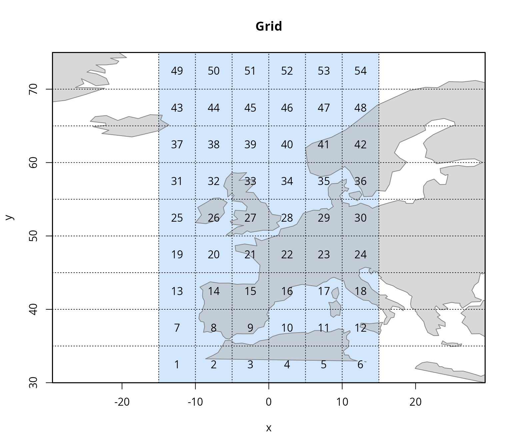
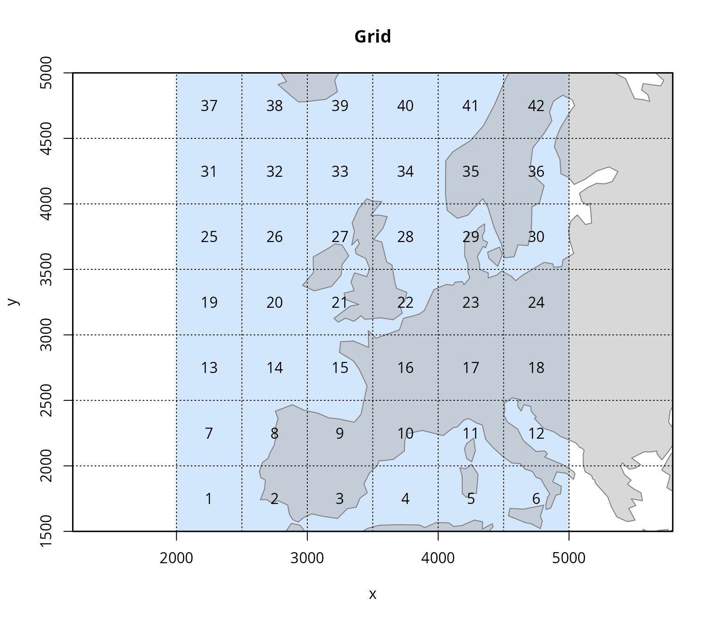

# Spatial grids for admove

This vignette provides more information about spatial grids in
**admove**. In particular, it demonstrates how to create and modify
spatial grids using the
[`create_grid()`](https://tokami.github.io/admove/reference/create_grid.md)
function.

Although the Kalman filter (KF) engine does not necessarily require a
grid AUTHOR_PAPER, it is good practice to define a spatial grid based on
the spatial extent of the tagging data. The grid is required by the
Continuous time Markov-chain (CTMC) engine and is used by both engines
for the spatial prediction of taxis, advection, diffusion and movement
rates and for visualisation. The
[`create_grid()`](https://tokami.github.io/admove/reference/create_grid.md)
function offers flexible functionality to define custom grids and to
manually include or exclude specific grid cells as needed.

``` r
library(admove)
library(sf)
```

The **sf** package is not a strict requirement of **admove**, but it
provides a lot of really useful functionality when working with spatial
information, such as spatial projections in **admove**.

## The most simple grid

The most simple default grid can be created by using
[`create_grid()`](https://tokami.github.io/admove/reference/create_grid.md)
without arguments:

``` r
grid <- create_grid()
```

This results in a unit grid with 100 cells:

``` r
summary(grid)
#> <admove_grid>
#>   cells:     100
#>   dims:      10 x 10
#>   cellsize:  0.10 x 0.10
#>   xrange:    [0.00, 1.00]
#>   yrange:    [0.00, 1.00]
#>   NAs:       0
#>   units:     not specified
```

which we can easily visualise with:

``` r
plot(grid)
```


It is easy to change the cell size and make a coarser grid:

``` r
grid <- create_grid(grid, cellsize = 0.2, plot = TRUE)
```


In a more realistic scenario, you might want to specify a grid in a
specific region given some x and y ranges. These could be longitude /
latitude ranges or correspond to any other units of a spatial
projection.

``` r
grid <- create_grid(xrange = c(-150, -70),
                    yrange = c(-30, 35),
                    cellsize = 10,
                    plot = TRUE)
```


Note, that it is required to add spatial reference information (`sref`)
to define the coordinate reference system (CRS) and units. Only then
land masses can be plotted and the values of the arguments `xrange` and
`yrange` are defined. One way to add the CRS is as an argument to the
[`create_grid()`](https://tokami.github.io/admove/reference/create_grid.md)
function directly:

``` r
grid <- create_grid(xrange = c(-15, 15),
                    yrange = c(30, 75),
                    cellsize = 5,
                    plot = TRUE,
                    crs = 4326,
                    plot_land = TRUE)
```



Here, we added the numeric code for the WGS 84 CRS in longitude/latitude
and consequently the landmasses are shown in the plot. Another way to
add the spatial reference information is after creating the grid:

``` r
## Land masses not plotted if spatial reference not defined
grid <- create_grid(xrange = c(-15, 15),
                    yrange = c(30, 75),
                    cellsize = 5,
                    plot = TRUE,
                    plot_land = TRUE)

## Add the spatial reference information
grid <- add_sref(grid, list(crs = 4326))

## Now the landmasses can be plotted
plot(grid, plot_land = TRUE)
```


When working with spatial projected grids, it might be nice to change
units. For example, the Albers projection

``` r
albers_crs <- sf::st_crs(3035)
```

is in m by default, which can lead to large values:

``` r
grid <- create_grid(xrange = c(2000000, 5000000),
                    yrange = c(1500000, 5000000),
                    cellsize = 500000,
                    crs = albers_crs,
                    plot = TRUE,
                    plot_land = TRUE)
```


In this case, it might be nicer to work in km:

``` r
grid <- create_grid(xrange = c(2000000, 5000000),
                    yrange = c(1500000, 5000000),
                    cellsize = 500000,
                    crs = albers_crs,
                    units = "km",
                    plot = TRUE,
                    plot_land = TRUE)
```



Or using an even smaller, custom scaling than m to km:

``` r
grid <- create_grid(xrange = c(2000000, 5000000),
                    yrange = c(1500000, 5000000),
                    cellsize = 500000,
                    crs = albers_crs,
                    crs_scale = 1e-6,
                    plot = TRUE,
                    plot_land = TRUE)
```


## Selecting grid cells

Another useful functionality of
[`create_grid()`](https://tokami.github.io/admove/reference/create_grid.md)
is that it allows to manually select all cells to be included in the
grid by setting `select = 1`. Any non-selected cell will be `NA` and
interpreted as a mask/boundary by **admove**, i.e. excluded from the
generator matrix.

``` r
grid <- create_grid(xrange = c(-150, -70),
                    yrange = c(-30, 35),
                    cellsize = 10,
                    select = 1,
                    crs = 4326,
                    plot_land = TRUE)
```

Specifying the CRS and setting `plot_land = TRUE` can help if the
selection is based on land/water boundaries.

When working in large spatial domains or many hundreds of fine grid
cells it might seem tedious to select all cells. Therefore, it is also
possible to do the opposite and de-select individual cells with
`select = 2`.

``` r
grid <- create_grid(xrange = c(-150, -70),
                    yrange = c(-30, 35),
                    cellsize = 10,
                    select = 2,
                    crs = 4326,
                    plot_land = TRUE)
```

Unfortunately, this interactive functionality cannot be well
demonstrated in a vignette. Moreover, this manual selection might be a
poor option in terms of reproducibility or automatic scripts. Therefore,
the argument `select` also accepts a vector with the grid cell indices
that should be selected, as for example here to select cells in the
Eastern Pacific Ocean:

``` r
grid <- create_grid(xrange = c(-150, -70),
                    yrange = c(-30, 35),
                    cellsize = 10,
                    select = c(1:15,17:23,25:31,33:37,41:44),
                    crs = 4326,
                    plot = TRUE,
                    plot_land = TRUE)
```


Similarly, cells can be de-selected if negative indices are used:

``` r
grid <- create_grid(xrange = c(-150, -70),
                    yrange = c(-30, 35),
                    cellsize = 10,
                    select = -c(16,24,32,38:40,45:48),
                    crs = 4326,
                    plot = TRUE,
                    plot_land = TRUE)
```


## A spatial grid based on tags

Another convenient way to define a spatial grid with
[`create_grid()`](https://tokami.github.io/admove/reference/create_grid.md)
is the feed it other **admove** objects, such as tagging data or
covariate fields. Let’s assume you have smoe mark-recapture tagging data
available, for demonstration we use the simulated example mark-recapture
tags for skipjack tuna in the Eastern Pacific Ocean included in
**admove**:

``` r
head(skjepo$ctags)
#>      fish_id date_time species  rel_len   rel_lon    rel_lat date_caught
#> 1   u6hq3n-1  43901.52     111 45.91377 -105.4224  0.3943493    44272.60
#> 2  u6hq3n-10  43901.52     111 47.41883 -105.4224  0.3943493    44017.43
#> 3 u6hq3n-100  43851.60     111 52.86190 -114.3733 -6.5771942    44064.60
#> 4 u6hq3n-101  43851.60     111 45.20155 -114.3733 -6.5771942    44533.34
#> 5 u6hq3n-102  43851.60     111 50.92635 -114.3733 -6.5771942    44407.73
#> 6 u6hq3n-103  43851.60     111 46.54024 -114.3733 -6.5771942    44113.42
#>   recap_lon   recap_lat
#> 1 -107.6288  -1.0960298
#> 2 -108.7149 -11.9331602
#> 3 -120.7287   0.2138117
#> 4 -121.1731  -7.8260759
#> 5 -103.4598  15.7295759
#> 6 -115.1396 -13.8510942
```

With one line, these tags can be converted into the expected format by
**admove**, check out
[`vignette("preparing-tags")`](https://tokami.github.io/admove/articles/preparing-tags.md)
for more details on preparing tagging data:

``` r
ctags <- prep_tags(x = skjepo$ctags,
                   tag_type = "c",
                   names = c(t0 = "date_time",
                             x0 = "rel_lon",
                             y0 = "rel_lat",
                             t1 = "date_caught",
                             x1 = "recap_lon",
                             y1 = "recap_lat"),
                   date_origin = "1899-12-30",
                   sref = list(crs = 4326))

head(ctags)
#>            t         x          y      id    fish_id species  rel_len tag_type
#> 1  7.5022514 -105.4224  0.3943493   wl4-1   u6hq3n-1     111 45.91377        c
#> 2 60.5147514 -107.6288 -1.0960298   wl4-1   u6hq3n-1     111 45.91377        c
#> 3  0.3710766 -114.3733 -6.5771942  wl4-10 u6hq3n-107     111 50.60561        c
#> 4 90.7871481 -132.6482 -5.1631626  wl4-10 u6hq3n-107     111 50.60561        c
#> 5  5.6279940 -116.2434  8.8340880 wl4-100 u6hq3n-189     111 46.50313        c
#> 6 43.4663868 -109.1361 11.4681655 wl4-100 u6hq3n-189     111 46.50313        c
#>   use
#> 1   1
#> 2   1
#> 3   1
#> 4   1
#> 5   1
#> 6   1
```

Once they are processed, we can just define a default spatial grid based
on them:

``` r
grid <- create_grid(ctags,
                    plot = TRUE,
                    plot_land = TRUE,
                    auto_layout = FALSE)

## plot tags on top of the spatial grid
plot(ctags, add = TRUE, auto_layout = FALSE)
```


The dimensions of the grid are defined based on the extreme positions in
the tagging data. If the cell size is not specified, it is defined to
yield 100 grid cells in total.

## A spatial grid based on covariate fields

Similarly, a spatial grid can be defined based on available **admove**
covariate fields. Let’s use the covariate fields of the simulated
example data for Montagus harrier:

``` r
plot(montagus_harrier$cov[,,1,drop=FALSE])
```


As with the tagging data, we can just pass the covariate fields to
[`create_grid()`](https://tokami.github.io/admove/reference/create_grid.md):

``` r
grid <- create_grid(montagus_harrier$cov,
                    plot = TRUE,
                    plot_land = TRUE,
                    auto_layout = FALSE)
```


If not specified, the cell size of the covariate field is taken over for
covariate fields. But, it would be easy enough to create a coarser cell
size:

``` r
grid <- create_grid(montagus_harrier$cov,
                    cellsize = 1,
                    plot = TRUE,
                    plot_land = TRUE,
                    auto_layout = FALSE)
```


Similarly, to tags and covariate fields,
[`create_grid()`](https://tokami.github.io/admove/reference/create_grid.md)
accepts any other `admove_*` classes, for example lists with simulated
data (`admove_sim`) as created by
[`sim_data()`](https://tokami.github.io/admove/reference/sim_data.md) or
**admove**’s data list (`admove_data`) as created by
[`setup_data()`](https://tokami.github.io/admove/reference/setup_data.md).

## A spatial grid based on a spatial object

Another useful feature about
[`create_grid()`](https://tokami.github.io/admove/reference/create_grid.md)
is that it accepts spatial objects from other packages, such as spatial
objects (of class `sf` or `sfc`) from R package **sf** Pebesma and
Bivand (2023) or `RasterLayer` from the R package **raster** (Hijmans
2025). For example we can use part of the world map contained in
**admove** to create a grid for Lake Eerie in North America:

``` r
## get land from admove's internal data
land <- admove:::.get_land()

## cut to Northeast Atlantic
land_nea <- sf::st_crop(land, sf::st_bbox(
  c(xmin = -45, xmax = 35,
    ymin = 30,  ymax = 80),
  crs = sf::st_crs(4326)
))

## dissolve to a single geometry
land_nea <- sf::st_union(sf::st_geometry(land_nea))

## create proper sf object
land_nea <- sf::st_sf(geometry = land_nea, crs = 4326)

## plot the map
plot(sf::st_geometry(land_nea))
```


By default, this selects all grid cells on land:

``` r
grid <- create_grid(land_nea)
plot(grid, plot_land = TRUE)
```


By setting the argument `select = -1` we can turn the default selection
around and select every grid cells that is not on land:

``` r
grid <- create_grid(land_nea, select = -1)
plot(grid, plot_land = TRUE)
```


If we are interested with a either starting selection and then continue
choosing cells by selecting or de-selecting, we can set `select 1` or
`select = 2` with the default or inverse selection of cells inside
polygons, respectively:

``` r
grid <- create_grid(land_nea, select = 1)
plot(grid, plot_land = TRUE)
```

## Summary

## References

Hijmans, Robert J. 2025. *Raster: Geographic Data Analysis and
Modeling*. Manual. <https://doi.org/10.32614/CRAN.package.raster>.

Pebesma, Edzer. 2018. “Simple Features for R: Standardized Support for
Spatial Vector Data.” *The R Journal* 10 (1): 439–46.
<https://doi.org/10.32614/RJ-2018-009>.

Pebesma, Edzer, and Roger Bivand. 2023. *Spatial Data Science: With
Applications in R*. Chapman and Hall/CRC.
<https://doi.org/10.1201/9780429459016>.
