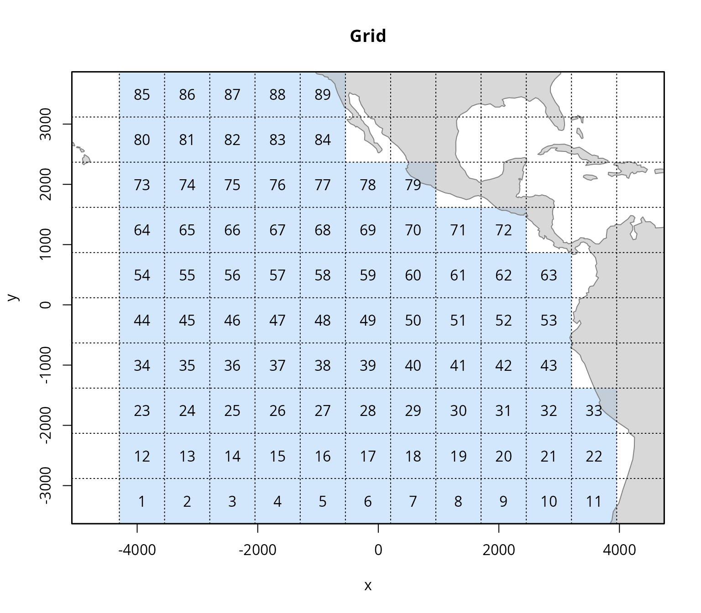
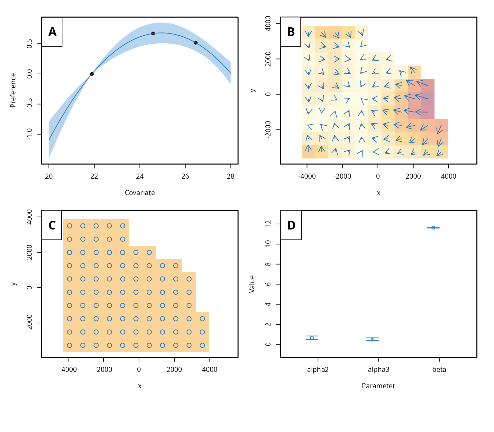

# Fine-scale movement modeling based on tagging data

This tutorial illustrates the application of the *admove* package to
model fine-scale movement based on tagging data.

**Outline:**

1.  Prepare the data
2.  Fit the model
3.  Results
4.  Advanced settings
5.  Summary
6.  References

The package is loaded into the R environment with:

``` r
library(admove)
```

This introductory tutorial uses a simulated data set included in the
package: “skjepo”. It is already available after loading the package and
corresponds to a list that includes the main simulation object (of class
`admove_sim`), which contains all required simulated data and can be
used right away to fit the model, as well as five individual data sets:
`grid`, `cov`, `ctags`, `dtags`, and a fitted object `fit`.

``` r
str(skjepo, 1)
#> List of 6
#>  $ sim  :List of 8
#>   ..- attr(*, "class")= chr [1:2] "admove_sim" "list"
#>   ..- attr(*, "sref")=List of 3
#>   .. ..- attr(*, "class")= chr "admove_sref"
#>   ..- attr(*, "tref")=List of 3
#>   .. ..- attr(*, "class")= chr "admove_tref"
#>  $ grid :List of 8
#>   ..- attr(*, "class")= chr [1:2] "admove_grid" "list"
#>   ..- attr(*, "sref")=List of 3
#>   .. ..- attr(*, "class")= chr "admove_sref"
#>  $ cov  : 'admove_cov' num [1:13, 1:12, 1:8] 25.5 25.9 26.1 26 25.9 ...
#>   ..- attr(*, "dimnames")=List of 3
#>   ..- attr(*, "sref")=List of 3
#>   .. ..- attr(*, "class")= chr "admove_sref"
#>   ..- attr(*, "tref")=List of 3
#>   .. ..- attr(*, "class")= chr "admove_tref"
#>  $ ctags:'data.frame':   200 obs. of  9 variables:
#>  $ dtags:List of 20
#>  $ fit  :List of 14
#>   ..- attr(*, "class")= chr [1:2] "admove" "list"
#>   ..- attr(*, "sref")=List of 3
#>   .. ..- attr(*, "class")= chr "admove_sref"
#>   ..- attr(*, "tref")=List of 3
#>   .. ..- attr(*, "class")= chr "admove_tref"
```

These data sets illustrate the typical structure of raw input data and
demonstrate how the functions in the *admove* package can be used to
convert them into the format required by the model as demonstrated in
the next section.

## Prepare the data

The `skjepo` data list contains two main tagging data sets: one with
information on releases and recoveries of mark-recapture tags, and
another with track data from data-storage tags. These data sets can be
prepared for analysis using the built-in function
[`prep_tags()`](https://tokami.github.io/admove/reference/prep_tags.md),
allowing users to specify which columns contain the release and
recapture times and locations, and automatically convert date fields to
the required format.

A key aspect of the preparation of tagging data and the use of this
function is the space and time reference information. The data set with
the mark-recapture tags contains information about the date and position
when individuals were released and recaptured:

``` r
head(skjepo$ctags)
#>      fish_id date_time species  rel_len   rel_lon    rel_lat date_caught
#> 1   u6hq3n-1  43901.52     111 45.91377 -105.4224  0.3943493    44272.60
#> 2  u6hq3n-10  43901.52     111 47.41883 -105.4224  0.3943493    44017.43
#> 3 u6hq3n-100  43851.60     111 52.86190 -114.3733 -6.5771942    44064.60
#> 4 u6hq3n-101  43851.60     111 45.20155 -114.3733 -6.5771942    44533.34
#> 5 u6hq3n-102  43851.60     111 50.92635 -114.3733 -6.5771942    44407.73
#> 6 u6hq3n-103  43851.60     111 46.54024 -114.3733 -6.5771942    44113.42
#>   recap_lon   recap_lat
#> 1 -107.6288  -1.0960298
#> 2 -108.7149 -11.9331602
#> 3 -120.7287   0.2138117
#> 4 -121.1731  -7.8260759
#> 5 -103.4598  15.7295759
#> 6 -115.1396 -13.8510942
```

The time information might be a date of a numeric value corresponding to
a date or just relative time passed since an origin. Similarly, position
information might correspond to any coordinate reference system (CRS).
This can either be specified when using the
[`prep_tags()`](https://tokami.github.io/admove/reference/prep_tags.md)
function or afterwards. We show both ways below.

Besides the data set and specifying the tag type (“c” for
mark-re*c*apture, “d” for *d*ata-storage, or “s” for mark-re*s*ight
tags), a key argument for the function is a named vector that links the
required time (“t”), and positions (“x” and “y”) with the column headers
in the data set. Mark-recapture tags might be available in two data
formats: in the long format, similar to the data-storage and
mark-resight tags, with one time and two position columns, or in the
wide format with two time columns (containing the release (“t0”) and
recapture time (“t1”)) and four position columns (“x0” and “x1”, and
“y0” and “y1”). For full details on how to use a function, consult its
documentation. See the “preparing-tags” vignette for more information on
different tag formats and how to convert tags between them.

``` r
## Prepare mark-recapture
ctags <- prep_tags(skjepo$ctags,
                   tag_type = "c",
                   names = c(t0 = "date_time", t1 = "date_caught",
                             x0 = "rel_lon", x1 = "recap_lon",
                             y0 = "rel_lat", y1 = "recap_lat"),
                   date_origin = "1899-12-30",
                   sref = list(crs = 4326),
                   tref = list(origin = as.POSIXct("2020-01-01", "UTC"),
                               units = "month"))

## Load dtags
dtags <- prep_tags(skjepo$dtags,
                   tag_type = "d",
                   names = c(t = "time", x = "mptlon", y = "mptlat"),
                   date_origin = "1899-12-30")

## Adjust the space reference information
dtags <- add_sref(dtags, list(crs = 4326))

## Adjust the time reference information
dtags <- add_tref(dtags, list(origin = as.POSIXct("2020-01-01", "UTC"),
                              units = "month"), shift_origin = TRUE)
```

As a next step, it is recommendable to check the space and time
reference information. All data components and objects in *admove* that
contain information about space and/or time include a `sref` (space
reference information) and a `tref` (time reference information)
attribute. These can be accessed with the
[`sref()`](https://tokami.github.io/admove/reference/sref.md) and
[`tref()`](https://tokami.github.io/admove/reference/tref.md) fuctions
or investigated when printing the summary of the any *admove* object:

``` r
## Summarise the tagging information
summary(c(ctags, dtags))
#> <admove_tags>
#>   tags total:     220
#>   ---------------------------------
#>   data-storage tags
#>   n:              20
#>   average over ids:
#>   n obs:          108.15
#>   duration:       10.74
#>   time step:      0.10
#>   x step:         -0.04
#>   y step:         -0.02
#>   ---------------------------------
#>   mark-recapture tags
#>   n:              200
#>   average over ids:
#>   n obs:          2.00
#>   duration:       10.20
#>   time step:      10.20
#>   x step:         -2.59
#>   y step:         -1.27
#>   ---------------------------------
#>   crs:            WGS 84 [EPSG:4326]
#>   crs units:      degree
#>   stored units:   degree
#>   crs scale:      1 degree = 1 degree
#>   origin:         2020-01-01 UTC
#>   units:          month
#>   period:         12
```

The output provides some information about the tags and informs us that
the WGS 84 \[EPSG:4326\] CRS was specified for the tags. The time
reference information is specified, here with weekly time steps and the
date origin corresponding to January 19th, 2020. This is the default
behaviour of the
[`prep_tags()`](https://tokami.github.io/admove/reference/prep_tags.md)
function, which does not infer space reference information by default
but defines the origin based on the first tag release time and the time
step based on the average life time of the tags.

Usually, it makes sense to specify a coordinate reference system and
revise the time reference information. This ensures that the space and
time units and scales are aligned between all *admove* components
(e.g. covariate fields, grids). We can specify time and space reference
information and add them to the tags with the following lines:

``` r
## Define the target time reference information
tref_target <- create_tref(origin = as.POSIXct("2020-01-01", "UTC"),
                           units = "month")

## Define the target space reference information using Azimuthal Equidistant
## centered at (−110, 0)
sref_target <- create_sref(crs = "+proj=aeqd +lat_0=0 +lon_0=-110 +datum=WGS84 +units=m +no_defs",
                             units = "km")

## Adjust the reference info for the tags
ctags <- add_sref(ctags, sref_target, transform_crs = TRUE)
ctags <- add_tref(ctags, tref_target, shift_origin = TRUE)

dtags <- add_sref(dtags, sref_target, transform_crs = TRUE)
dtags <- add_tref(dtags, tref_target, shift_origin = TRUE)
```

Now, the tags have the required space and time reference information:

``` r
summary(c(ctags, dtags))
#> <admove_tags>
#>   tags total:     220
#>   ---------------------------------
#>   data-storage tags
#>   n:              20
#>   average over ids:
#>   n obs:          108.15
#>   duration:       10.74
#>   time step:      0.10
#>   x step:         -4.80
#>   y step:         -1.76
#>   ---------------------------------
#>   mark-recapture tags
#>   n:              200
#>   average over ids:
#>   n obs:          2.00
#>   duration:       10.20
#>   time step:      10.20
#>   x step:         -285.87
#>   y step:         -140.05
#>   ---------------------------------
#>   crs:            Azimuthal Equidistant [custom]
#>   datum:          World Geodetic System 1984
#>   crs units:      metre
#>   stored units:   km
#>   crs scale:      1 metre = 0.001 km
#>   origin:         2020-01-01 UTC
#>   units:          month
#>   period:         12
```

Although the Kalman filter (KF) engine does not necessarily require a
grid AUTHOR_PAPER, it is good practice to define a spatial grid based on
the spatial extent of the tagging data. This grid is required by the
Continuous time Markov-chain (CTMC) engine and is used by both engines
for the spatial prediction of taxis, advection, diffusion and movement
rates and for visualisation. The `create_grid` function offers flexible
functionality to define custom grids and to manually include or exclude
specific grid cells as needed. See more information in the
[`vignette("spatial-grids")`](https://tokami.github.io/admove/articles/spatial-grids.md).

Since manual selection of grid cells is not feasible in this automated
vignette, we use the grid provided in the skjepo data set, but modify it
to create a coarser resolution of 1000x1000km cells.

``` r
grid <- create_grid(skjepo$grid, cellsize = 750)
plot(grid, plot_land = TRUE)
```



Another important component of *admove* are covariate fields that taxis,
advection, and diffusion through habitat preference functions. The
`prep_cov` function formats this data into the structure required by the
model. The covariate fields can come from multiple sources and
correspond to a range of different formats, the
[`vignette("preparing-covariates")`](https://tokami.github.io/admove/articles/preparing-covariates.md)
gives more information on the required format and how to convert data
between different formats.

``` r
## covariates
cov <- prep_cov(skjepo$cov)
plot_cov(cov[,,1:4], plot_land = TRUE)
```


It is not suprising if the covariate fields have different time
reference information. Here, for example, the covariate fields have the
same date origin as specified above (January 1st, 2020), but the time
steps correspond to quarters:

``` r
tref(cov)
#> $origin
#> [1] "2020-01-01 UTC"
#> 
#> $units
#> [1] "quarter"
#> 
#> $period
#> [1] 4
#> 
#> attr(,"class")
#> [1] "admove_tref"
```

This is not a problem and the next functions would inform you about this
mismatch and provide tips on how to resolve them. Here we use one of the
potential ways by specifying the desired time reference information and
setting the argument `shift_tref = TRUE` in the next fuction that
combines all data into a single object.

``` r
## combine and check data
dat <- setup_data(grid = grid,
                  cov = cov,
                  tags = c(ctags, dtags),
                  tref = tref_target,
                  shift_tref = TRUE)
```

The `default_conf` function generates a list of default configuration
settings, including flags that control which model functionalities are
activated. It is good practice to review this configuration list to
ensure that the default settings align with the goals and structure of
your analysis.

``` r
## Default configurations
conf <- default_conf(dat)
```

Similarly, the `default_par` function generates a list of default model
parameters and their initial values. While users can adjust the initial
values as needed, caution is required when modifying parameter
dimensions. These dimensions must be consistent with the input data
(e.g., the number of environmental fields) and the configuration
settings (e.g., whether passive advection, taxis, or both are used).

``` r
## Default parameters
par <- default_par(dat, conf)
```

kappa is a scaling parameter that is not estimated but scales the
spatial gradient of the habitat preference function to a taxis rate. It
carries the dimensions L\\^2\\ L\\^{-1}\\ and might differ from 1 in the
simulation study. To get comparable parameter values between the
simulation and estimation, it is important to fix it to the value of the
simulation in the estimation:

``` r
par$logKappa <- skjepo$sim$par_sim$logKappa
```

With all necessary input data prepared, the model is now ready to be
fitted using *admove*.

## Fit the model

The model is fitted using the `admove` function. Depending on the
model’s complexity, the number of tags and the estimation engine chosen
(KF or CTMC), this step may take up to several minutes.

``` r
## Fitting movement model
fit <- admove(dat, conf, par,
              verbose = TRUE)
#>   0: 2.6621148e+08:  0.00000  0.00000  0.00000
#>   1:     97824176.: 0.0304759 0.0479782 0.998383
#>   2:     58120629.: 0.144985 -0.724747  1.62271
#>   3:     20987545.: 0.0501387 -0.525837  2.59813
#>   4:     11698081.: 0.804236 -0.390874  3.24087
#>   5:     4176101.9: 0.653388 -0.172935  4.20511
#>   6:     2315402.5:  1.38283 -0.0565109  4.87917
#>   7:     899135.28: 0.881767 0.0650439  5.73601
#>   8:     477695.10:  1.00349 -0.518613  6.53883
#>   9:     182171.19: 0.849998 -0.184989  7.46896
#>  10:     113092.53:  1.49966 0.328658  8.02941
#>  11:     58857.934:  1.09352 0.155624  8.92669
#>  12:     44857.604:  1.75497 -0.0553574  9.64640
#>  13:     33307.738:  1.51547 0.211375  10.5799
#>  14:     31866.793:  1.93611  1.08067  10.8395
#>  15:     30696.247:  1.49547 0.690489  11.6480
#>  16:     30669.312:  1.42363 0.758147  11.6641
#>  17:     30619.129:  1.02488 0.728827  11.6525
#>  18:     30612.294: 0.685632 0.525310  11.5934
#>  19:     30610.207: 0.683988 0.526026  11.6453
#>  20:     30610.119: 0.667122 0.508135  11.6376
#>  21:     30610.106: 0.664376 0.512619  11.6350
#>  22:     30610.102: 0.669039 0.516039  11.6361
#>  23:     30610.102: 0.668728 0.515873  11.6366
#>  24:     30610.102: 0.669268 0.516236  11.6365
#>  25:     30610.102: 0.669468 0.516370  11.6365
#>  26:     30610.102: 0.669485 0.516383  11.6365
```

The total run time for model construction, fitting, uncertainty
estimation and prediction was here (in minutes):

``` r
sum(fit$times)
#> [1] 1.08927
```

In addition to the input data lists, the returned object also includes
the `obj` (from RTMB) and `opt` (from the minimiser). Both contain the
estimated parameter values and other details relevant to the model
fitting.

``` r
fit$opt$par
#>      alpha      alpha       beta 
#>  0.6694851  0.5163828 11.6364623
```

## Results

The summary function can be used to get an overview of the model fit and
estimated parameters:

``` r
summary(fit)
#> <admove>
#>  Convergence: 0  MSG: relative convergence (4)
#>  Objective function at optimum: 30610.1031617
#> 
#>   data-storage tags:     20
#>   mark-recapture tags:   200
#> 
#>  Model parameter estimates w 95% CI 
#>           estimate      cilow      ciupp        sd 
#>  alpha2  0.6694851  0.4986248  0.8403454 0.0871752 
#>  alpha3  0.5163828  0.3785349  0.6542308 0.0703319 
#>  beta   11.6364623 11.5957004 11.6772241 0.0207973 
#> 
```

*admove* provides several functions for visualising model results. All
plotting functions start with `plot_.`, e.g. `plot_taxisis()` to plot
the estimated taxis as arrows on a map. To get a quick overview over the
main results, we can use:

``` r
plot(fit)
```



In this example, since the data are simulated and the true parameters
are known, we can use the `plot_compare` function to visualise both the
estimated and true habitat preferences and movement patterns.

``` r
plot_compare(sim = skjepo$sim,
             fit = fit,
             plot_land = TRUE)
```


## Advanced settings

There are several advanced settings in *admove* that will be covered in
future vignettes. However, this vignette highlights three important
ones: (i) grouping tags into release events to speed up model fitting,
(ii) using CTMC engine as an alternative to the KF engine, and (iii) map
parameters to fix or exclude them during estimation.

It is common for multiple tags to be released at the same location and
time, in particular for mark-recapture tags. Grouping these tags into
release events can significantly speed up the movement modeling, as the
analysis is performed per event rather than per individual tag. The
potential loss in accuracy is likely minimal and can be evaluated
through sensitivity analyses, while the grouped approach is recommended
for the baseline scenario due to its efficiency. The `use_release_event`
function enables this grouping by assigning tags to release events based
on a specified spatial grid and time vector.

``` r
tags <- use_release_events(c(ctags, dtags),
                           grid = create_grid(xrange = dat$xrange,
                                              yrange = dat$yrange,
                                              cellsize = 100),
                           time_cont = seq(dat$trange[1],
                                           dat$trange[2],
                                           1/4))
```

The release time and position of the mark-recapture tags has now been
overwritten to the values of the release events and the individual tags
have been combined to the individual release events:

``` r
ctags <- get_ctags(tags)

str(split(ctags, ctags$id),1)
#> List of 5
#>  $ 1:Classes 'admove_tags' and 'data.frame': 41 obs. of  11 variables:
#>   ..- attr(*, "sref")=List of 3
#>   .. ..- attr(*, "class")= chr "admove_sref"
#>   ..- attr(*, "tref")=List of 3
#>   .. ..- attr(*, "class")= chr "admove_tref"
#>  $ 2:Classes 'admove_tags' and 'data.frame': 41 obs. of  11 variables:
#>   ..- attr(*, "sref")=List of 3
#>   .. ..- attr(*, "class")= chr "admove_sref"
#>   ..- attr(*, "tref")=List of 3
#>   .. ..- attr(*, "class")= chr "admove_tref"
#>  $ 3:Classes 'admove_tags' and 'data.frame': 41 obs. of  11 variables:
#>   ..- attr(*, "sref")=List of 3
#>   .. ..- attr(*, "class")= chr "admove_sref"
#>   ..- attr(*, "tref")=List of 3
#>   .. ..- attr(*, "class")= chr "admove_tref"
#>  $ 4:Classes 'admove_tags' and 'data.frame': 41 obs. of  11 variables:
#>   ..- attr(*, "sref")=List of 3
#>   .. ..- attr(*, "class")= chr "admove_sref"
#>   ..- attr(*, "tref")=List of 3
#>   .. ..- attr(*, "class")= chr "admove_tref"
#>  $ 5:Classes 'admove_tags' and 'data.frame': 41 obs. of  11 variables:
#>   ..- attr(*, "sref")=List of 3
#>   .. ..- attr(*, "class")= chr "admove_sref"
#>   ..- attr(*, "tref")=List of 3
#>   .. ..- attr(*, "class")= chr "admove_tref"
```

While the function could also identify release events for data-storage
and mark-resight tags using the argument `tag_types = c("d","s","c")`,
this might lead to unintended consequences when using the KF engine
which includes an update step.

By default, *admove* uses the Kalman filter approach as described in
AUTHOR_PAPER. However, it also supports an alternative method based on
the matrix exponential. You can easily switch between the two by setting
the `engine` argument in the configuration list. To use the matrix
exponential approach, simply set `engine = 2`.

``` r
conf <- default_conf(dat)
conf$engine <- 2
```

Lastly, it may be useful to map parameters, for example, to estimate a
single value for both directions of passive advection. A list of default
map settings can be generated using the `default_map` function. The
resulting map can then be passed to `admove` to control which parameters
are estimated, fixed, or shared.

``` r
map <- default_map(dat, conf, par)
```

### Summary

This vignette introduced the main features and workflow of the *admove*
package for estimating animal movement and habitat preferences from
tagging data. Using a simulated data set (`skjepo`), we demonstrated how
to prepare the required inputs, configure and fit the model, and
visualise the results.

We covered the preparation of mark-recapture and data-storage tags
([`prep_tags()`](https://tokami.github.io/admove/reference/prep_tags.md)),
covariate fields
([`prep_cov()`](https://tokami.github.io/admove/reference/prep_cov.md)),
and spatial grids
([`create_grid()`](https://tokami.github.io/admove/reference/create_grid.md)).
These were then combined using
[`setup_data()`](https://tokami.github.io/admove/reference/setup_data.md)
into a format suitable for model fitting. Configuration and parameter
initialisation were handled through
[`default_conf()`](https://tokami.github.io/admove/reference/default_conf.md)
and
[`default_par()`](https://tokami.github.io/admove/reference/default_par.md),
with model fitting performed using
[`admove()`](https://tokami.github.io/admove/reference/admove.md). The
[`plot_fit()`](https://tokami.github.io/admove/reference/plot_fit.md)
and
[`plot_compare()`](https://tokami.github.io/admove/reference/plot_compare.md)
functions allowed us to visualise results and compare estimated versus
true movement and habitat preference patterns.

Several advanced options were introduced, including grouping tags into
release events (`get_release_event()`), switching between the two
currently implemented engines for inferences: KF and CTMC engines
(`engine` argument), and map parameters
([`default_map()`](https://tokami.github.io/admove/reference/default_map.md))
to simplify or constrain estimation.

This basic example provides a foundation for applying *admove* to real
tagging data. More details about the methodology are described in
AUTHOR_PAPER and in the other vignettes (get an overview with
`browseVignettes("admove")`). Further details about functions and their
arguments can be found in the help files of the functions
([`help()`](https://rdrr.io/r/utils/help.html) or `?`, where the dots
refer to any function of the package).

## References
